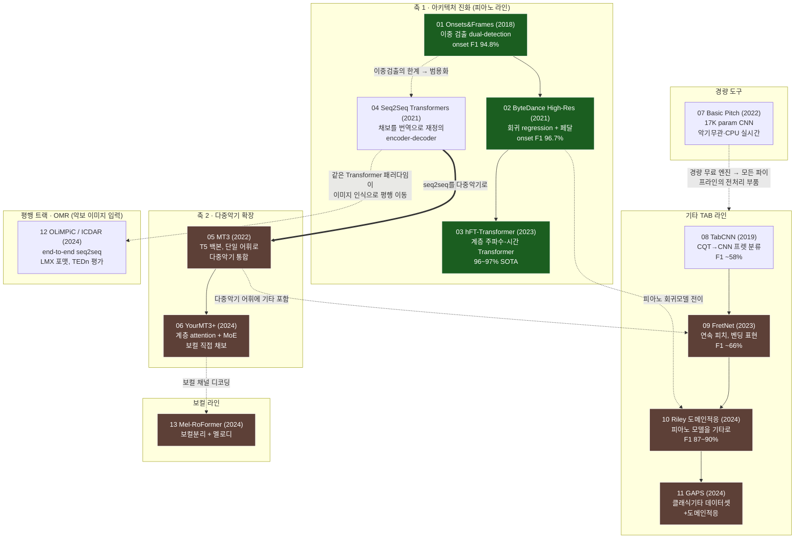

# 논문 관계도와 흐름 — 13편으로 보는 AMT의 진화

> AMT 리서치 아카이브 종합문서 · 작성 2026-06-21
> 출처: AMT 통합 마스터 보고서 v2 §1, AMT 음악채보 리서치 보고서 §1
> 대상: 최소한의 프로그래밍 지식을 가진 독자

## 한 줄 관통 주제

**피아노는 거의 해결됐고(near-solved), 프런티어는 다중악기·기타·보컬로 이동했다. 음정 검출(pitch detection)은 풀렸고, 진짜 난제는 "읽을 수 있는 악보로 바꾸는 마지막 1마일(last mile)", 즉 악보화(notation)다.**

이 한 문장이 아카이브에 모인 13편을 꿰는 실이다. 초기 논문들은 "오디오에서 음을 얼마나 정확히 잡아내는가"를 두고 경쟁했고, 이 싸움은 피아노에서 거의 끝났다. 그래서 최근 논문들은 두 방향으로 갈라진다. 하나는 **더 어려운 대상**(다중악기, 기타, 보컬)으로의 확장이고, 다른 하나는 잡아낸 음을 **사람이 읽는 악보**로 정리하는 후처리 — 리듬 양자화(rhythm quantization), 프렛/현 할당(fret/string assignment), 악보 표기다. AMT는 더 이상 "음을 듣는" 문제가 아니라 "악보를 쓰는" 문제로 무게중심이 옮겨갔다.

## 두 개의 큰 축

AMT 연구는 두 개의 직교하는 축으로 정리하면 깔끔하다.

**축 1 — 아키텍처의 진화 (어떻게 모델을 만드는가):**
이중 검출(dual-detection) → 회귀(regression) → seq2seq Transformer → 자기지도 foundation model. 이 흐름의 핵심은 "전용으로 정교하게 설계한 모델"에서 "범용 Transformer를 번역기처럼 쓰는 모델"로의 패러다임 전환이다. 채보를 마치 기계번역(스펙트로그램이라는 언어를 MIDI 이벤트라는 언어로 옮기는 일)으로 재정의한 것이 분수령이었다.

**축 2 — 대상 악기의 확장 (무엇을 채보하는가):**
피아노 → 다중악기 → 기타(TAB) → 보컬. 피아노는 음고가 이산적(88건반)이고 정밀 라벨 데이터(MAESTRO)가 풍부해 가장 먼저 정복됐다. 그 뒤로 갈수록 음고가 연속적이고(벤딩·비브라토), 라벨 데이터가 희소하고, 추가 난제(현/프렛 모호성)가 붙어 난이도가 급격히 오른다.

그리고 이 두 축과 **평행하게 달리는 별도 트랙**이 하나 더 있다. 오디오가 아니라 **악보 이미지를 입력**으로 받는 OMR(Optical Music Recognition)이다. 입력이 완전히 다르지만, 흥미롭게도 OMR도 똑같이 "세그멘테이션 파이프라인 → end-to-end seq2seq Transformer"로 수렴하고 있다. 오디오 채보와 OMR이 같은 Transformer 패러다임으로 만난다는 것이 2024~2026년의 큰 그림이다.

## 계보 다이어그램

(녹색 = 거의 해결된 피아노 영역, 갈색 = 현재 프런티어)

## 라인별 상세

### 피아노 라인 (01 → 02 → 03, 그리고 04로 분기) — "거의 끝난 싸움"

**01 Onsets&Frames**가 출발점이다. 신경망을 두 갈래로 나눠 한쪽은 음의 시작(onset)만, 다른 쪽은 음이 울리는 모든 순간(frame)을 검출하게 했다. 두 갈래가 합의해야만 새 음을 만들 수 있게 해서 거짓 검출을 크게 줄였다. 마치 두 명의 검사관이 동시에 "여기 음이 있다"고 동의해야 통과시키는 식이다. MAESTRO 학습 시 onset F1이 약 94.8%로, 이후 모든 피아노 채보의 기준선이 됐다.

**02 ByteDance High-Res Piano**는 발상을 한 단계 끌어올렸다. 프레임을 "음 있음/없음"으로 분류하는 대신, 음의 시작·끝 시점 자체를 연속값으로 **회귀(regression)** 했다. 시간을 칸으로 끊어 세는 대신 자처럼 연속적으로 재는 것이다. 덕분에 onset F1 96.7%에 더해 velocity(세기)와 서스테인 페달까지 잡아냈다. 오픈소스로 공개돼 지금도 가장 많이 쓰이는 피아노 엔진이다.

**03 hFT-Transformer**(Sony AI)는 시간축과 주파수축 양쪽에 Transformer attention을 거는 2단계 계층 구조로 96~97%대 SOTA를 달성했다. 피아노 채보가 사실상 성숙 단계에 들어섰음을 확인하는 마침표다.

**04 Seq2Seq Transformers**는 피아노 라인에서 분기하는 결정적 전환점이다. 채보 전용 아키텍처를 통째로 버리고, 범용 encoder-decoder Transformer로 스펙트로그램을 "MIDI 이벤트 토큰 시퀀스"로 번역했다. 복잡한 후처리 없이도 전용 모델급 성능을 냈고, 이것이 곧이어 MT3·YourMT3+의 토대가 된다.

### 다중악기 라인 (04 → 05 → 06) — "프런티어의 시작"

**05 MT3**는 04의 seq2seq를 다중악기로 확장했다. T5 백본(약 6,000만~7,700만 파라미터)으로 여러 데이터셋을 **단일 토큰 어휘**로 통합 학습해, 하나의 범용 Transformer가 임의의 악기 조합을 트랙별로 동시에 채보하게 했다. 데이터가 적은 악기(기타 등)의 성능을 크게 끌어올린 것이 핵심 기여다. 다만 연구급 모델이라 실제 팝 음원에는 취약하다(GuitarSet zero-shot note F1 32.0).

**06 YourMT3+**(QMUL)는 MT3의 최고급 후속이다. 계층적 attention과 Mixture-of-Experts(MoE)를 도입하고, 별도 분리기 없이 **보컬을 직접 채보**한다. 10개 데이터셋에서 벤치마크했고, 저자들이 "실제 팝 녹음에서의 한계"를 솔직히 명시한 점이 인상적이다 — 프런티어가 아직 미해결임을 연구자 스스로 인정한 것이다.

### 기타 TAB 라인 (08 → 09 → 10 → 11) — "추가 난제가 붙은 별도 문제"

기타 탭은 음 검출에 더해 **프렛/현 할당**과 **주법**이라는 난제가 추가된 별도 문제다. 한 음높이를 여러 (현, 프렛) 조합으로 연주할 수 있어 오디오만으로는 어느 위치인지 구분이 거의 불가능하다.

**08 TabCNN**(2019)은 CQT를 CNN에 넣어 6현 프렛을 분류한 초기 모델(F1 ~58%, 프레임 단위라 onset 정밀도가 낮다). **09 FretNet**(2023)은 연속 피치를 추정해 현/프렛으로 그룹핑하며, 거의 유일하게 **벤딩·비브라토를 표현**할 수 있다(F1 ~66%, 재현율이 약점). **10 Riley 도메인적응**(2024)은 02 ByteDance 피아노 모델을 기타로 적응시켜 zero-shot 87.3% / supervised 89.7%로 도약했다(단, 음만 출력하고 프렛/현은 내지 않으며 확장 주법은 명시적으로 제외). **11 GAPS**(2024)는 이 도메인적응을 클래식 기타로 확장하며, 현재 최대 규모의 실기타 오디오 데이터셋(14h, 200+연주자)을 함께 내놓았다.

이 라인의 화살표가 02 피아노 모델에서 10으로 이어진다는 점이 핵심이다 — **다른 라인의 성숙한 모델을 빌려와 데이터가 부족한 영역을 공략**하는 도메인 적응이 기타 라인의 돌파구였다.

### 보컬 라인 (13) — "가장 늦게 열린 전선"

**13 Mel-RoFormer**(ByteDance, 2024)는 보컬 분리와 멜로디 추출을 결합한다. 06 YourMT3+의 보컬 채널 디코딩과 함께, 보컬이 vibrato·glissando 등 연속 음고로 가득해 라벨이 부족한 가장 어려운 전선 중 하나임을 보여준다.

### 경량 도구 (07) — "라인을 가로지르는 부품"

**07 Basic Pitch**(Spotify)는 어느 라인에도 속하지 않으면서 모든 라인에 스며든다. 약 17K 파라미터의 초소형 CNN으로 악기무관·polyphonic·CPU 실시간이라, 개인 개발자의 최적 출발점이자 다른 파이프라인의 전처리 부품으로 표준화됐다.

### OMR 평행 트랙 (12) — "다른 입력, 같은 패러다임"

**12 OLiMPiC**(ICDAR 2024)은 오디오가 아니라 **악보 이미지**를 입력받는다. 입력은 다르지만 OMR도 세그멘테이션 파이프라인에서 end-to-end seq2seq Transformer로 옮겨갔다. LMX(Linearized MusicXML) 포맷과 TEDn(tree-edit-distance) 평가지표를 쓴다. 04에서 시작된 "채보=번역" 패러다임이 이미지 인식 영역에서도 똑같이 재현된 것이 이 트랙의 의미다.

## 종합: 무게중심의 이동

13편을 겹쳐 보면 분명한 그림이 나온다. **음정 검출이라는 1세대 문제는 피아노에서 풀렸다.** 그래서 연구는 (a) 더 어려운 대상(다중악기·기타·보컬)과 (b) 악보화 last mile(리듬 양자화·프렛 할당·표기)로 이동했다. 그리고 모델 아키텍처는 전 영역에서 — 오디오든 이미지든 — 범용 seq2seq Transformer와 foundation model로 수렴 중이다. 풀린 문제(음정)와 남은 난제(악보화)의 경계가 이 아카이브 전체의 지형도다.

## 관련 종합문서

- 용어 상세: `00_마스터_용어집.md`
- 2024~2026 동향: `10_2025_2026_landscape.md`
- 데이터셋 전체: `11_데이터셋_인벤토리.md`
