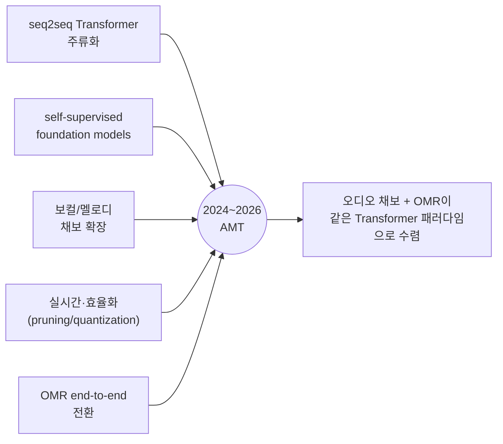

# 2024–2026 AMT 분야 지형도 (Landscape)

> AMT 리서치 아카이브 종합문서 · 작성 2026-06-21
> 출처: AMT 통합 마스터 보고서 v2 §1.7, AMT 음악채보 리서치 보고서 §1.4
> 대상: 최소한의 프로그래밍 지식을 가진 독자

## 한눈에 보는 5대 흐름

2024~2026년 AMT 분야는 한 문장으로 요약된다. **음정 검출은 사실상 풀렸고(특히 피아노), 분야 전체가 "범용 Transformer + foundation model"이라는 공통 패러다임으로 수렴하면서, 경쟁의 무게중심이 정확도에서 악보화(notation)와 워크플로 통합으로 이동했다.** 마스터 보고서가 정리한 다섯 갈래의 동향을 차례로 본다.

## 1. seq2seq Transformer의 주류화

2021년 04 Seq2Seq Transformers가 "채보 = 번역"이라는 패러다임을 연 뒤, 이 방식은 2024~2026년 다중악기 채보의 명실상부한 주류가 됐다. MT3(05)를 잇는 **YourMT3+**(06, MLSP 2024)가 전 데이터셋에서 MT3를 능가하며 흐름을 굳혔다. YourMT3+는 계층적 attention과 Mixture-of-Experts를 도입하고, 무엇보다 **보컬을 분리 전처리 없이 직접 채보**하는 multi-channel decoding을 선보였다.

핵심은 더 이상 악기마다 전용 모델을 손으로 설계하지 않는다는 것이다. 하나의 범용 encoder-decoder Transformer가 여러 악기를 단일 토큰 어휘로 통합 처리한다. 다만 마스터 보고서가 분명히 지적하듯, 이들 연구급 모델은 **실제 팝 녹음에서는 여전히 취약**하다 — YourMT3+ 저자조차 그 한계를 솔직히 명시했다. 벤치마크(클린)에서의 강력함과 실전 믹스에서의 급락 사이의 간극이 이 흐름의 미해결 지점이다.

## 2. 자기지도 foundation model의 부상

라벨이 비싸고 희소한 음악 도메인의 만성 문제를 우회하는 길로, **self-supervised foundation model**이 떠올랐다. MusicFM 같은 모델이 대량의 비라벨 오디오로 사전학습해, 라벨 부족을 보완한다. Aria-MIDI 같은 대규모 데이터셋의 등장도 이 흐름을 떠받친다.

비유하자면, 답안지(라벨) 없이 방대한 문제집(비라벨 오디오)만 풀며 음악의 일반 구조를 먼저 익힌 뒤, 적은 라벨로 특정 과제에 빠르게 적응하는 방식이다. 음성·언어 분야에서 검증된 foundation model 전략이 음악 AMT로 옮겨온 것이며, 데이터 병목이 가장 심한 비피아노 영역(기타·보컬)에서 특히 의미가 크다. 솔로 개발자 관점에서 핵심 함의는 명확하다 — **이 foundation model들은 빅테크가 학습해 무료로 공개하므로, 직접 학습하지 말고 가져다 쓰라**는 것이다.

## 3. 보컬·멜로디 채보로의 확장

피아노가 정복되면서 연구 프런티어가 보컬·멜로디로 이동했다. 보컬은 vibrato·glissando 등 풍부한 연속 음고를 갖고 라벨 데이터가 부족해 어려운 영역이다. 이 전선에서 두 갈래의 접근이 보인다.

하나는 음성 도메인의 인코더를 음악에 이식하는 것이다(wav2vec 2.0 등). 다른 하나는 06 YourMT3+의 보컬 직접 채보와 13 **Mel-RoFormer**(ByteDance)의 보컬분리+멜로디 결합처럼, 분리와 채보를 통합하는 것이다. 멜로디 추출은 노래방·음악교육·송라이팅 같은 B2C 응용과 직결돼 상업적 수요도 뚜렷하다.

## 4. 실시간·효율화 (real-time / efficiency)

채보를 연구실 밖 실사용으로 끌어내려는 효율화 흐름이다. pruning(불필요한 가중치 가지치기)과 quantization(가중치 정밀도 낮추기)으로 모델을 가볍게 만들어 실시간 채보를 목표한다. 07 Basic Pitch가 약 17K 파라미터로 CPU 실시간을 이미 보여줬듯, "충분히 작고 빠른" 모델에 대한 수요가 분명하다.

효율화는 단순한 최적화가 아니라 제품 형태를 바꾼다. 실시간이 되면 라이브 연주 피드백, 모바일 온디바이스 채보, DAW 내 즉시 변환 같은 새 워크플로가 열린다. 차별화 축이 정확도에서 "어떤 맥락에 매끄럽게 끼우는가"로 옮겨가는 큰 흐름과 맞물린다.

## 5. OMR의 end-to-end 전환

오디오가 아닌 악보 이미지를 다루는 OMR도 같은 시기 큰 전환을 겪었다. 기존의 다단계 세그멘테이션 파이프라인(staff 검출 → 기호 검출 → 의미 복원)에서 **end-to-end seq2seq Transformer**로 이동한 것이다. 대표 사례가 12 **OLiMPiC**(ICDAR 2024)으로, 피아노포름 악보를 대상으로 LMX(Linearized MusicXML) 포맷과 TEDn 평가지표를 도입했다.

이것이 2024~2026년 지형도의 가장 중요한 메타-관찰로 이어진다. **오디오 채보와 OMR이 같은 Transformer 패러다임으로 수렴**하고 있다는 점이다. 입력이 소리(스펙트로그램)냐 그림(악보 이미지)이냐만 다를 뿐, 둘 다 "입력을 악보 토큰 시퀀스로 번역"하는 동일한 틀로 풀린다. 다만 OMR에서도 **필기 악보(HMR)는 여전히 대부분 실패**하며, 인쇄 OMR과의 난이도 격차가 크다는 점은 변하지 않았다.

## 종합: 무엇이 풀렸고 무엇이 남았나

| 영역 | 2024~2026 상태 | 남은 난제 |
|---|---|---|
| 피아노 채보 | near-solved (96~97%) | 사실상 없음 |
| 다중악기 채보 | seq2seq로 진전, 클린에서 양호 | 실제 팝 믹스 급락 |
| 보컬/멜로디 | 직접 채보 등장(06,13) | 연속 음고·라벨 부족 |
| 기타 TAB | 도메인적응으로 87~90% | 프렛/현 할당·주법 |
| OMR | end-to-end 전환 | 필기 악보·cascading error |
| **악보화(공통)** | **여전히 최대 난제** | **양자화·박자·조표·성부·표기** |

마스터 보고서의 결론과 정확히 일치한다. **음정 검출이라는 1세대 문제는 (피아노에서) 풀렸다.** 분야 전체가 범용 Transformer와 foundation model로 수렴하면서, 모델 정확도 경쟁은 상향평준화됐다. 그 결과 진짜 가치가 남은 곳은 모델 자체가 아니라 (a) 더 어려운 대상으로의 확장과 (b) 잡아낸 음을 사람이 읽는 악보로 정리하는 **last mile**, 그리고 (c) 그 결과를 학습·작곡·DAW·노래방 같은 맥락에 끼우는 워크플로 통합이다.

## 관련 종합문서

- 논문 계보: `00_논문_관계도와_흐름.md`
- 데이터셋 동향: `11_데이터셋_인벤토리.md`
- 솔로 개발자 전략: `15_솔로개발자_로드맵.md`
