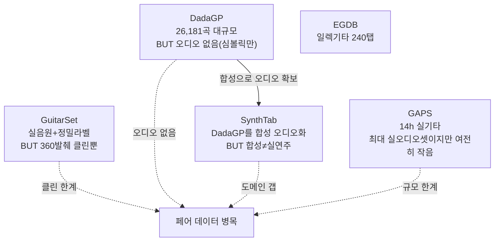

# 데이터셋 인벤토리 (Dataset Inventory)

> AMT 리서치 아카이브 종합문서 · 작성 2026-06-21
> 출처: AMT 통합 마스터 보고서 v2 §1.4, AMT 음악채보 리서치 보고서 §1.2
> 대상: 최소한의 프로그래밍 지식을 가진 독자

## 왜 데이터셋이 분야의 지형을 결정하는가

AMT 분야가 왜 피아노는 정복하고 기타·보컬은 못 했는지를 한마디로 설명하면 **데이터** 때문이다. 피아노는 MAESTRO라는 약 200시간짜리 정밀 라벨 데이터가 있어 모델이 배불리 학습했고, 기타·보컬은 (실음원 + 정확한 라벨) 페어가 만성적으로 희소해 굶주렸다. 이 문서는 오디오·기타·OMR 세 영역의 핵심 데이터셋을 정리한다. 특히 **기타의 만성적 페어 데이터 부족**이 분야 전체의 병목임을 강조한다.

## 데이터셋 종합 표

| 데이터셋 | 영역 | 규모 | 형식·특징 | 주 용도 |
|---|---|---|---|---|
| **MAESTRO v3** | 오디오(피아노) | ~198.7h, 1,276연주 | Disklavier 오디오-MIDI 3ms 정렬 | 피아노 채보 표준 벤치마크 |
| **Slakh2100** | 오디오(다중) | ~145h, 34악기 | 합성(synthetic) + 정렬 MIDI | 다중악기 채보·음원분리 |
| **MusicNet** | 오디오(다중) | 클래식 녹음 | 다중악기 실연주 + 전문가 라벨 | 관현악 다중악기 채보 |
| **URMP** | 오디오(다중) | 44곡 | 앙상블, multi-stem + 10ms 라벨 | 다중악기 채보·분리 |
| **MAPS** | 오디오(피아노) | 클래식 피아노 | 합성 + 실녹음 | (구) 피아노 벤치마크 |
| **GuitarSet** | 기타 | 360발췌(~30초), 6연주자 | 헥사포닉 픽업(현별 분리) + 현/프렛/주법 16종 | 탭 채보 표준 정답(GT) |
| **DadaGP** | 기타 | 26,181곡, 739장르 | GuitarPro 토큰 — **심볼릭만, 오디오 없음** | 심볼릭 모델·합성 소스 |
| **SynthTab** | 기타 | DadaGP 파생 | 심볼릭 탭을 플러그인으로 합성 오디오화 | 합성 페어 데이터 보강 |
| **GAPS** | 기타 | 14h, 200+연주자 | 클래식기타 실연주 + 노트레벨 MIDI | 현재 최대 실기타 오디오셋 |
| **EGDB** | 기타 | 240탭 × 4톤 | 일렉기타(앰프 모델 렌더) | 일렉기타 채보 |
| **CVC-MUSCIMA** | OMR | 필기 1,000장 | 손글씨 악보 이미지 | 필기 OMR |
| **MUSCIMA++** | OMR | 필기 상세주석 140장 | primitive 단위 정밀 주석 | OMR 기호 검출 |
| **DeepScores** | OMR | 인쇄 대규모 | 대량 인쇄 악보 | 인쇄 OMR 학습 |
| **PrIMuS / Camera-PrIMuS** | OMR | 단성부 인쇄 | 단선율 인쇄 악보(+카메라 변형) | end-to-end OMR |
| **OLiMPiC** | OMR | 피아노포름 2024 | LMX 포맷, TEDn 평가 동반 | seq2seq OMR 벤치마크 |

## 영역별 해설

### 오디오 데이터셋 — 피아노의 풍요, 다중악기의 합성 의존

오디오 채보의 정점에 **MAESTRO**가 있다. 약 198.7시간, 1,276개 연주를 Disklavier(연주를 MIDI로 캡처하는 피아노)로 녹음해 오디오와 MIDI를 약 3ms 정밀도로 정렬했다. 이 "풍부하고 정밀한 라벨"이 피아노 채보가 96~97%까지 올라온 결정적 원동력이다. 사람 채보자 100명을 동원해도 만들기 어려운 정확한 정답지를, 기계 피아노가 자동으로 찍어준 셈이다.

다중악기로 가면 사정이 달라진다. **Slakh2100**(~145h, 34악기)은 실연주가 아니라 **합성(synthetic)**이다 — 진짜 합주를 정확히 라벨링하기가 너무 어려워, 가상악기로 합성해 라벨을 자동 확보한 것이다. **MusicNet**과 **URMP**(44곡 앙상블)는 실연주 라벨을 제공하지만 규모가 작다. **MAPS**는 피아노 구(舊) 벤치마크로 MAESTRO 이전 세대다. 다중악기 영역이 합성 데이터에 의존한다는 사실 자체가, 실연주 라벨링의 어려움과 그로 인한 실전 성능 급락을 설명한다.

### 기타 데이터셋 — 만성적 페어 데이터 부족 ★핵심★

기타 TAB이 어려운 근본 이유는 **(실음원 + 정확한 현/프렛/주법) 페어 데이터가 희소**하다는 데 있다. 각 데이터셋은 이 부족을 서로 다른 방식으로 메우려 하지만 모두 한계가 있다.

- **GuitarSet**은 탭 채보의 표준 정답이다. 헥사포닉 픽업으로 6개 현을 개별 수음해 현별로 정확한 라벨을 달았고, 주법 16종까지 주석했다. 하지만 360발췌(~30초)의 **클린 환경뿐**이라, 여기서 87~90%가 나와도 실제 팝 믹스에선 급락한다.
- **DadaGP**는 26,181곡·739장르의 거대한 GuitarPro 탭 모음이지만 **결정적으로 오디오가 없다**(심볼릭만). 탭은 있는데 그 탭이 어떻게 들리는지의 녹음이 없으니, 그대로는 "오디오→탭" 학습에 못 쓴다.
- **SynthTab**은 이 문제를 우회한다. DadaGP의 심볼릭 탭을 상용 플러그인으로 합성해 오디오를 만들어 페어를 확보한다. 다만 합성음과 실연주 사이의 도메인 갭이 남는다.
- **GAPS**(14h, 200+연주자)는 현재 최대 규모의 실기타 오디오 데이터셋으로, 클래식 기타 실연주에 노트레벨 MIDI를 붙였다. 그래도 MAESTRO(~200h)에 비하면 여전히 작다.
- **EGDB**는 일렉기타 전용으로, 240개 탭을 4가지 톤(앰프 모델)으로 렌더링했다.

> ⚠️ 마스터 보고서 주의: 이전 보고서들에 등장한 **"GOAT" 데이터셋은 존재가 확인되지 않는다**(arXiv/Zenodo/GitHub 미검증, GAPS와의 혼동으로 추정). 인용 시 주의.

요약하면, 기타에는 "크면 오디오가 없고(DadaGP), 오디오가 정확하면 작거나 클린뿐(GuitarSet·GAPS)"이라는 딜레마가 있다. 그래서 분야는 **합성(SynthTab)과 도메인 적응(10 Riley, 11 GAPS)**으로 우회한다 — 데이터를 늘릴 수 없으니 다른 영역(피아노)에서 배운 모델을 빌려오거나 데이터를 가짜로 만들어 채우는 것이다.

### OMR 데이터셋 — 인쇄는 풍족, 필기는 척박

악보 이미지 인식(OMR)의 데이터는 입력 종류에 따라 갈린다. **인쇄 악보** 쪽은 비교적 풍족하다 — **DeepScores**(인쇄 대규모), **PrIMuS/Camera-PrIMuS**(단성부 인쇄, 카메라 촬영 변형 포함), 그리고 12 OLiMPiC이 쓴 피아노포름 데이터셋이 있다. 반면 **필기 악보**는 **CVC-MUSCIMA**(필기 1,000장), **MUSCIMA++**(필기 상세주석 140장) 정도로 적고, 손글씨의 무한한 변이 탓에 필기 OMR(HMR)이 여전히 대부분 실패하는 근본 원인이 된다. **MUSCIMA++**는 notehead·stem·flag 같은 primitive 단위로 정밀 주석돼 기호 검출 연구에 쓰인다.

## 종합: 데이터가 곧 난이도 순서

이 인벤토리는 마스터 보고서의 난제 분석을 데이터 관점에서 다시 증명한다.

| 대상 | 데이터 상황 | 결과 |
|---|---|---|
| 피아노 | MAESTRO ~200h, 3ms 정밀 | near-solved 96~97% |
| 다중악기 | 합성(Slakh) 의존, 실연주 소량 | 클린 양호·실전 급락 |
| 기타 | 페어 데이터 만성 부족 | 합성·도메인적응 우회 |
| OMR(인쇄) | DeepScores 등 풍족 | end-to-end 진전 |
| OMR(필기) | 소량·고변이 | 대부분 실패 |

**데이터가 풍부한 순서가 곧 정복된 순서다.** 솔로 개발자에게 주는 함의는 분명하다 — 직접 foundation model을 학습하려 들지 말고(특히 비피아노는 페어 데이터가 희소해 불가능에 가깝다), 오픈 모델을 가져와 **니치 합성 데이터(DadaGP/SynthTab 방식)로 fine-tune** 하는 길이 현실적이다.

## 관련 종합문서

- 논문 계보: `00_논문_관계도와_흐름.md`
- 적용 권고: `12_적용_권고.md`
- 제작 로드맵: `14_제작_로드맵.md`
