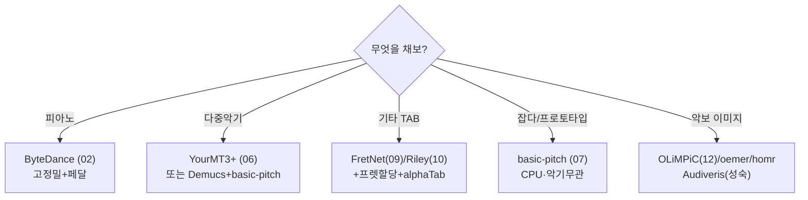

# 적용 권고 (Application Recommendation)

> AMT 리서치 아카이브 종합문서 · 작성 2026-06-21
> 출처: AMT 통합 마스터 보고서 v2 §4, AMT 음악채보 리서치 보고서 §4
> 대상: 채보 기능을 실제로 구현하려는 개발자

## 핵심 원칙: 모델은 빌리고, 노력은 last mile에 쏟아라

실무 의사결정의 출발점은 단순하다. **채보 엔진(모델)은 이미 오픈소스로 상향평준화됐으니 직접 학습하지 말고 가져다 쓰고, 진짜 노력은 MIDI를 사람이 읽는 악보로 바꾸는 last mile — 리듬 양자화와 프렛/현 할당, 그리고 편집 UI — 에 쏟아라.** 추론 비용은 곡당 몇 센트에 불과하고, 진짜 해자는 노테이션 품질과 워크플로에서 나온다.

## 1. 모델 선택 가이드

상황별 추천 모델이다. 하나의 만능 모델은 없으며, 악기·용도별로 나누는 것이 현실적이다.

| 상황 | 추천 모델 | 이유 |
|---|---|---|
| 빠른 프로토타입 / 잡다한 악기 | **basic-pitch** (07) | pip 한 줄, 악기무관, CPU 가능 |
| 피아노 고정밀(페달 포함) | **ByteDance piano** (02) | onset F1 96.7%, 페달 검출 |
| 멀티악기 트랙별 | **YourMT3+** (06) 또는 Demucs+basic-pitch | seq2seq SOTA 또는 분리 후 조합 |
| **기타 TAB — 표현력 우선** | **FretNet** (09) + 프렛할당 + alphaTab | 연속 피치(벤딩·비브라토) 표현이 강점, 단 재현율 낮음(현-무관 노트 F1 ~0.66)·탭화는 직접 |
| **기타 TAB — 정확도 우선** | **Riley 도메인적응** (10) + 프렛할당 + alphaTab | GuitarSet 87~90% 고정확도, 단 프렛/현 미출력(음표 채보)·탭화는 직접 |
| 보컬/드럼/코드 종합 | Omnizart | 종합 처리 |
| 이미지/PDF → 악보 | **OLiMPiC**(12) 계열 / oemer·homr(PoC), Audiveris(성숙) | end-to-end 또는 성숙 도구 |
| 운영 부담 없이 결과만 | Klangio API / AnthemScore | 상용 SaaS |



## 2. audio → MIDI → score 파이프라인

채보의 표준 파이프라인은 다섯 단계다. 핵심은 **모델 추론까지는 쉽고, 그 뒤 양자화·악보화가 진짜 일**이라는 점이다.

```
오디오 입력 (wav/mp3)
   ↓ [선택] 음원 분리 — Demucs v4 (악기별 stem)
   ↓ 특징 추출 — librosa / torchaudio (CQT, log-mel)
   ↓ 모델 추론 — basic-pitch / ByteDance / YourMT3+ / FretNet
   ↓ MIDI 생성 (음 시작·길이·피치·velocity)
   ↓ 리듬 양자화 / 비트 트래킹  ★최대 병목★
   ↓ MusicXML / GuitarPro → 악보·탭 렌더 (music21 + MuseScore / alphaTab)
```

단일 악기에 강한 모델(basic-pitch)을 쓸 때의 핵심 패턴은, 앞단에 **Demucs로 stem을 분리**한 뒤 stem별로 채보해 합치는 것이다. 이렇게 하면 멀티악기 곡도 단일악기 모델로 처리할 수 있다.

OMR(이미지 입력)은 앞단만 다르다: 이미지 → (dewarp 보정) → staff 검출 → 기호 인식(세그멘테이션 또는 seq2seq) → MusicXML. 출력단(에디터·재생)은 오디오 채보와 공유한다.

## 3. 두 개의 병목: 리듬 양자화와 프렛 할당

마스터 보고서가 일관되게 지목하는 두 약한 고리다. 모든 도구(상용 포함)가 여기서 약하고, 그래서 솔로 개발자가 가치를 더할 수 있는 곳이다.

### 병목 A — 리듬 양자화 (rhythm quantization)
채보 MIDI는 사람 연주의 미세한 밀고 당김을 그대로 담아 타이밍이 불규칙하다. 이를 정확한 박·음표 길이(4분음표·8분음표 등)로 정돈하지 않으면 악보가 읽기 어렵게 지저분해진다. 손으로 그린 들쭉날쭉한 선을 격자에 맞춰 곧게 펴는 일과 같다. **악보 가독성의 핵심 병목**이며, AnthemScore조차 멀티트랙을 한 보표에 쏟고, 사용자는 결국 MuseScore로 리듬을 손본다. neural beat-tracking 기반 양자화 연구를 차용하는 것이 개선 경로다. DTW/score-following 경험이 이 양자화에 직결된다.

### 병목 B — 프렛/현 할당 (fret/string assignment)
기타 탭 고유의 난제다. 한 음높이를 여러 (현, 프렛) 조합으로 칠 수 있어 오디오만으로는 위치 구분이 거의 불가능하다. 그래서 **탭 F는 항상 multipitch F보다 낮다**(음은 맞혀도 위치에서 점수를 잃는다). 측정지표는 TDR(맞은 피치 중 현/프렛까지 맞춘 비율)이다. 해법 알고리즘은 세 갈래다.

- **HMM/Viterbi + 운지 전환 비용**: 손이 한 위치에서 다음 위치로 옮기는 비용을 최소화하는 경로를 찾는다.
- **그래프 최단경로**: 가능한 운지들을 그래프로 놓고 가장 짧은(연주하기 쉬운) 경로를 고른다.
- **신경망 inhibition**: 물리적으로 불가능한 현 중복을 억제한다.

> ⚠️ 오디오→렌더링된 탭까지의 end-to-end 오픈소스는 없다. 모든 성숙한 레포(FretNet/amt-tools 등)는 "오디오→음/현 데이터"에서 멈춘다. 따라서 [채보 모델] → [프렛 할당] → [GuitarPro/MusicXML 생성] → [alphaTab 렌더]의 3단 조립이 유일한 현실 경로다.

## 4. 출력 포맷: MIDI / MusicXML / GuitarPro

세 포맷의 역할이 다르며, 어떤 출력을 목표로 하느냐가 도구 선택을 좌우한다.

| 포맷 | 담는 것 | 특징 | 한계 |
|---|---|---|---|
| **MIDI** | 피치·velocity·길이 | 연주 데이터 1차 출력 | 이명동음·박자·조표 없음 → 그대로는 악보 아님 |
| **MusicXML** | 올림/내림·박자·조표·마디 | 악보 표기 교환 표준 | 사람이 읽는 악보 |
| **GuitarPro (.gp5/.gpx)** | 탭+주법+재생 | TAB 교환 사실상 표준 | 기타 전용 |

변환 허브는 **music21**(Python, MIT)으로 MIDI↔MusicXML↔LilyPond를 잇는다. 단 실연주 MIDI는 양자화 전처리를 거쳐야 깔끔한 악보가 된다.

## 5. 렌더링: alphaTab

웹에서 탭을 보여주고 재생까지 하려면 **alphaTab**(MPL-2.0)이 압도적이다. Songsterr 스타일에 가장 근접한 라이브러리다.

| 라이브러리 | 입력 | TAB 렌더 | 싱크 재생 |
|---|---|---|---|
| **alphaTab** ⭐ | Guitar Pro 3-8 + MusicXML | O | **O** (내장 신디+커서, 오디오/영상 싱크) |
| VexFlow | API 작성 | O | X (렌더 전용) |
| OpenSheetMusicDisplay | MusicXML | O | 재생 스폰서 게이트 |

alphaTab은 Guitar Pro .gp5/.gpx와 MusicXML을 모두 읽고, 내장 신디사이저로 커서를 따라가며 오디오/영상에 싱크해 재생한다. **Guitar Pro .gp5/.gpx가 사실상 교환 표준**이므로, 탭 도구의 출력 목표를 여기에 맞추면 alphaTab으로 바로 렌더할 수 있다.

## 종합: 권장 스택

오디오→기타 탭을 만든다면 가장 검증된 조합은 다음이다.

```
Demucs (분리) → FretNet/basic-pitch (채보) → 프렛 할당(HMM/그래프)
→ music21 (양자화·MusicXML/GP 생성) → alphaTab (브라우저 탭 렌더+재생)
```

GPU는 Demucs·ByteDance·YourMT3+ 추론에 속도 이점이 있으나 필수는 아니며(basic-pitch는 CPU 충분), 비용은 곡당 몇 센트 수준이다. 지배적 비용은 모델이 아니라 **양자화·프렛 할당·편집 UI에 들이는 개발 시간**이며, 바로 거기서 경쟁우위가 쌓인다.

## 관련 종합문서

- 제작 로드맵(단계별): `14_제작_로드맵.md`
- 솔로 개발자 전략: `15_솔로개발자_로드맵.md`
- 데이터셋: `11_데이터셋_인벤토리.md`
