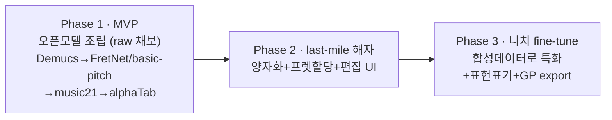
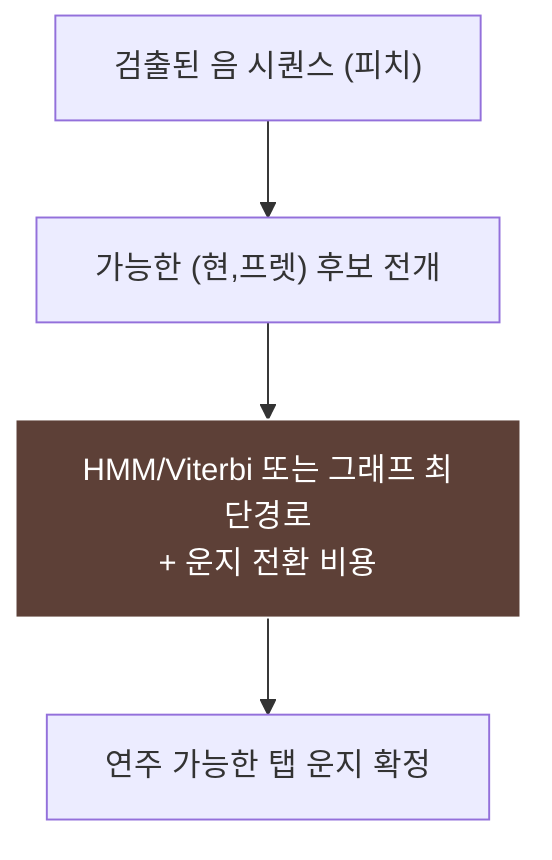

# 제작 로드맵 — 오디오 → 기타 TAB 도구 만들기

> AMT 리서치 아카이브 종합문서 · 작성 2026-06-21
> 출처: AMT 통합 마스터 보고서 v2 §4·§5·§6
> 대상: 오디오를 기타 탭으로 바꾸는 도구를 직접 만들려는 개발자

## 전제: 3단계, 한 방향

핵심 전략은 마스터 보고서가 정한 그대로다. **사전학습 모델을 wrapping하고, Demucs로 전처리하고, 노력을 MIDI→악보 변환 + 프렛 할당 + 편집 UI에 쏟는다.** foundation model을 학습하지 않는다. 추론은 곡당 몇 센트, 진짜 해자는 노테이션 품질과 큐레이션된 니치다. 세 단계는 다음과 같이 쌓인다.



## Phase 1 — MVP (수 주)

목표는 "어떤 오디오든 브라우저에서 기타 탭으로"를 빠르게 보여주는 얇은 웹앱이다. 단 이 단계의 산출물은 **양자화 전 raw 채보 + alphaTab 재생 데모**이지 출판 가능한 깔끔한 악보가 아니다 — 리듬 양자화는 Phase 2의 핵심 과제로 미룬다(아래 §Phase 2). 전부 오픈소스 부품의 조립이다.

```
오디오 입력
   ↓ Demucs v4         — 기타 stem 분리
   ↓ FretNet / basic-pitch  — 채보 (음 + 가능하면 현/프렛)
   ↓ music21           — MIDI 정리·MusicXML/GP 생성 (양자화는 Phase 2)
   ↓ alphaTab          — 브라우저 탭 렌더 + 싱크 재생
```

**기술 스택:**
- 채보: `basic-pitch`(pip 한 줄, 악기무관) 또는 `FretNet`(`cwitkowitz/guitar-transcription-continuous`, 연속 피치로 벤딩 표현)
- 분리: `Demucs v4`(Meta, ~9dB SDR)
- 후처리: `music21`(Python, MIDI↔MusicXML↔GP 허브)
- 렌더: `alphaTab`(MPL-2.0, Guitar Pro + MusicXML 입력, 내장 신디 재생)
- 보조: `librosa`(특징 추출), `torchaudio`(전처리)

**GPU 필요성:** basic-pitch 추론은 CPU로 충분하다. Demucs와 (쓴다면) ByteDance/YourMT3+는 GPU가 있으면 빠르지만 필수는 아니다. MVP는 CPU로도 돌릴 수 있다.

**검증 기준:** Klangio Guitar2Tabs·Songscription과 실곡 20개로 정직하게 벤치마크한다. **계속 진행 판단 기준 = 내 출력이 그들보다 편집이 덜 필요하면 우위가 있다.**

## Phase 2 — last-mile 해자 (본 게임)

여기가 진짜 차별화 구간이다. 약한 고리인 **MIDI→악보 변환 + 프렛 할당**에 직접 투자한다. 세 가지를 만든다.

**(a) 리듬 양자화:** neural beat-tracking 연구(Liu et al. 2022 등)를 차용해, 불규칙한 실연주 타이밍을 정확한 박·음표 길이로 정돈한다. DTW/score-following 경험이 그대로 직결된다. 목표는 "박스에서 바로 읽히는 리듬".

**(b) 연주가능성 제약 프렛/현 할당:** 한 음을 여러 위치로 칠 수 있는 모호성을, 운지 전환 비용을 최소화하는 경로 탐색으로 푼다.



알고리즘 선택지는 HMM/Viterbi(운지 전환 비용), 그래프 최단경로, 신경망 inhibition(물리적으로 불가능한 현 중복 억제)이다.

**(c) 오디오-싱크 편집 UI:** 거친 AI 출력을 사용자가 빠르게 깔끔한 탭으로 다듬는 human-in-the-loop 에디터. "마법 버튼"이 아니라 교정 루프가 핵심이다(Klangio Edit Mode, Soundslice 에디터 모델). 과대약속 금지.

**Phase 2 목표 지표:** GuitarSet급 소재에서 note onset F1 ~85%+ AND 박스에서 바로 읽히는 리듬.

## Phase 3 — 니치 fine-tune로 특화 (해자 굳히기)

오픈 모델을 처음부터 학습하지 말고(pretrain 금지), **니치 합성 데이터로 fine-tune** 한다. DadaGP/SynthTab 방식 — 심볼릭 탭을 상용 플러그인으로 합성 오디오화해 페어 데이터를 만든다. 여기에 표현 표기(벤딩·슬라이드·해머온)를 추가하고, Guitar Pro export + 브라우저 play-along이라는 킬러 워크플로를 붙인다.

소비자 유통이 어려우면 B2B API 각도로 전환한다(Moises의 "Music.AI" 플레이북 — 소비자 앱은 데이터 채널, 수익 엔진은 B2B API).

## 비용 구조

마스터 보고서의 비용 분석은 명확하다. **사전학습 추론은 싸고, 학습은 비싸다 — 학습은 피하라.**

| 항목 | 비용 | 비고 |
|---|---|---|
| basic-pitch 추론 | ~0 (CPU) | GPU 불필요 |
| Demucs/ByteDance 추론 | 곡당 몇 센트 | GPU 사용 시 |
| foundation model 학습 | 막대 | **하지 마라** |
| 양자화·프렛할당·UX 개발 | 당신의 시간 | **경쟁우위가 쌓이는 곳** |

지배적 비용은 컴퓨트가 아니라 노테이션 last mile과 UX에 들이는 개발 시간이며, 바로 그곳이 우위가 누적되는 지점이다.

## 단계별 요약

| Phase | 기간 | 산출물 | 성공 기준 |
|---|---|---|---|
| 1 MVP | 수 주 | 오픈모델 조립 웹앱 (raw 채보 + 재생, 양자화 전) | 경쟁 대비 편집 덜 필요 |
| 2 해자 | 본 게임 | 양자화+프렛할당+편집 UI | onset F1 85%+ & 읽히는 리듬 |
| 3 특화 | 확장 | 니치 fine-tune+표현표기+GP export | 킬러 워크플로 / B2B API |

## 관련 종합문서

- 적용·도구 상세: `12_적용_권고.md`
- 데이터셋(SynthTab/DadaGP): `11_데이터셋_인벤토리.md`
- 솔로 개발자 경쟁 분석: `15_솔로개발자_로드맵.md`
