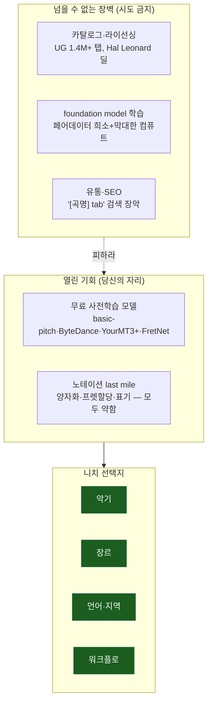

# 솔로 개발자 로드맵 — 경쟁 분석과 전략

> AMT 리서치 아카이브 종합문서 · 작성 2026-06-21
> 출처: AMT 통합 마스터 보고서 v2 §5 (솔로 개발자 경쟁 분석)
> 대상: 오디오 → 악보/기타 탭 변환 도구를 만들려는 솔로/소규모 개발자
> 톤: 정직하고 실행 가능하게.

## 한 문장 전략

**모델을 학습하지 마라. 인커번트의 카탈로그와 싸우지 마라. 무료 사전학습 모델을 wrapping하고, 모두가 약한 노테이션 last mile과 큐레이션된 니치에 노력을 쏟아라.** 인커번트의 진짜 해자는 AI가 아니라 콘텐츠+커뮤니티+라이선싱이고, 빅테크는 채보를 오픈소스로 풀어 버린다. 그 틈이 솔로 개발자의 자리다.

## 1. 넘을 수 없는 장벽 (시도하지 말 것)

솔로 개발자가 정면으로 싸우면 반드시 지는 세 영역이다. 마스터 보고서의 핵심 통찰은, 인커번트(Ultimate Guitar, Songsterr)의 해자가 **AI가 아니라 콘텐츠+커뮤니티+라이선싱**이라는 점이다.

**(a) 콘텐츠 라이브러리 & 라이선싱.** Ultimate Guitar는 검수된 무료 사용자 탭만 약 140만 개(전체 텍스트 탭+코드 200만+), 월 6,000만+ 방문이다. 이 카탈로그는 자동 채보가 아니라 **사람이 수작업으로 만든 크라우드소싱 탭 + 퍼블리셔 라이선스**다. Songsterr도 공식 FAQ에서 "모든 탭은 사용자가 기여하며, 우리가 직접 채보하지 않는다"고 못박는다. 게다가 UG는 MuseScore·Audacity·Hal Leonard(최대 악보 퍼블리셔)까지 수직 통합해 학습→기보→출판→라이선싱 funnel을 장악했다. 100만+ 탭 크라우드소싱이나 Hal Leonard/Sony 퍼블리셔 딜은 솔로가 복제 불가능하다. **카탈로그로 경쟁하지 마라.**

**(b) Foundation model 학습.** 대규모 페어 데이터(비피아노는 희소)와 막대한 컴퓨트가 필요하다. 기타만 봐도 GuitarSet은 360발췌 클린뿐이고 DadaGP는 오디오가 없다 — 처음부터 학습할 데이터 자체가 없다. **처음부터 학습하지 마라.**

**(c) 유통/SEO.** 인커번트가 "[곡명] tab" 검색과 앱스토어를 장악했다. 신규 진입자가 검색 유입으로 이기기 어렵다.

## 2. 낮아진 장벽 (당신의 기회)

반대로 두 영역은 솔로에게 활짝 열려 있다.

**(a) 모델은 무료·사전학습이다.** basic-pitch(07), ByteDance(02), YourMT3+(06), FretNet(09)이 전부 오픈소스다. 빅테크(Spotify·Google·ByteDance)는 채보를 직접 수익화하지 않고 오픈소스로 풀어 생태계 영향력을 확보하며, 그 무료 엔진이 상용 제품의 부품이 된다(basic-pitch → NeuralNote가 증거). 추론은 곡당 몇 센트, 또는 CPU로 공짜다. 즉 **모델이라는 가장 비싼 부품을 빅테크가 무료로 대주는** 셈이다.

**(b) 노테이션 last mile이 미완성이다.** MIDI를 읽을 수 있는 악보로 바꾸는 일(양자화·성부 분리·프렛 할당·표기)은 **상용 제품을 포함해 모두가 약하다.** AnthemScore는 멀티트랙을 한 보표에 쏟고, ScoreCloud는 음악 이론 지식을 요구하며, 사용자는 결국 MuseScore로 리듬을 손본다. 이 craft 문제가 솔로 개발자가 더 잘할 수 있는 지점이다.

## 3. 공략 가능한 니치

마스터 보고서가 꼽은 다섯 니치 축이다. 좁힐수록 인커번트의 규모 우위가 무력해진다.

| 축 | 내용 | 예시 |
|---|---|---|
| **악기** | 인커번트가 소홀한 특정 악기의 고품질 처리 | 기타 TAB의 정밀 프렛 할당 + 표현 표기(벤딩·슬라이드·해머온) |
| **장르** | 관용구가 있는 장르의 장르 인식 양자화·보이싱 | 재즈 comping, 핑거스타일, K-pop, 워십/CCM, 메탈 |
| **언어·지역** | 지역 커뮤니티·시장 | 한국 채보 커뮤니티, 일본 시장(Klangio 상위 시장이 미·일·한) |
| **워크플로** | 오디오-싱크 편집 UX로 거친 출력을 빠르게 깔끔한 탭으로 | human-in-the-loop 에디터 |
| **포지셔닝** | "채보 도우미"이지 "마법 버튼"이 아님 | 교정 루프 중심(Klangio Edit Mode, Soundslice 모델) |

특히 마지막 축이 중요하다. **과대약속을 하지 마라.** Soundslice 창업자가 ChatGPT가 없는 기능을 안내해 곤란을 겪은 일화의 교훈처럼, "버튼 한 번에 완벽한 탭"을 약속하면 실망을 부른다. confidence가 낮을 때 사용자에게 묻는 교정 루프 UX가 정직하고 실제로 더 강하다.

## 4. 전략적 통찰 — 왜 이 틈이 존재하는가

세 가지 구조적 사실이 솔로 개발자의 기회를 만든다.

**(1) 인커번트의 해자는 콘텐츠+커뮤니티이지 AI가 아니다.** 그들은 자동 채보로 카탈로그를 만든 게 아니라 20년간 크라우드소싱과 라이선싱으로 쌓았다. 즉 그들의 강점은 AI 기술 우위가 아니어서, **기술로는 따라잡을 게 별로 없다**. 역으로 그들도 AI 노테이션 품질에서 특별히 앞서 있지 않다.

**(2) 빅테크는 채보를 오픈소스로 풀어 버린다.** Spotify·Google·ByteDance에게 채보는 수익원이 아니라 연구 평판·생태계 영향력의 도구다. 그래서 최고 수준의 엔진이 무료로 풀린다 — 솔로 개발자가 그 엔진을 그대로 부품으로 쓴다. **가장 비싼 R&D를 거대 기업이 대신 해주고 공짜로 배포한다.**

**(3) 상용 수익 축이 B2C 앱 → B2B API로 이동 중이고, 차별화 축은 "정확도 → 워크플로 통합"으로 이동했다.** 정확도는 오픈 모델로 상향평준화됐으니, 경쟁은 "결과를 어떤 맥락(학습·작곡·DAW·노래방)에 끼우느냐"로 옮겨갔다. 이 워크플로 craft가 바로 솔로가 잘할 수 있는 영역이다.

결론: **넘을 수 없는 벽(콘텐츠·foundation 학습·유통)은 피하고, 빅테크가 무료로 푼 모델 위에서 모두가 약한 노테이션 last mile과 좁은 니치를 공략하라.** AMT 채보는 사용자 제공 오디오를 처리하는 도구일 때 카탈로그 호스팅보다 저작권상으로도 안전하다(MXTabs 폐쇄 사례 — 카탈로그 구축형은 퍼블리셔 소송 리스크).

## 5. 계획 변경 트리거 (언제 피벗할까)

정직한 로드맵에는 출구도 있어야 한다. 다음 신호가 보이면 전략을 바꾼다.

- **MuseScore NoteVision/Klangio가 우수한 무료 기타-탭-from-audio를 내면** → 더 얇은 니치(장르/언어/워크플로)나 순수 툴/UX로 피벗.
- **대규모 페어 audio↔TAB 데이터를 구축·확보하면** → 특화 모델 학습이 그 자체로 해자가 됨(이때만 학습이 정당화됨).
- **니치 커뮤니티(예: 채보 포럼)가 지불 의향을 보이면** → 커뮤니티+큐레이션에 집중(인커번트 해자 중 솔로가 작게 복제 가능한 유일한 부분).

## 종합: 솔직한 결론

솔로 개발자가 이길 수 있는 게임은 명확하다. 모델은 빌리고(빅테크가 무료로 줌), 카탈로그·유통은 포기하고(인커번트가 장악), **노테이션 last mile의 craft와 좁고 깊은 니치 커뮤니티**에 전부를 건다. 추론 비용은 곡당 몇 센트로 무시할 만하고, 진짜 자산은 양자화·프렛 할당·편집 UX에 쏟은 시간과 큐레이션된 니치다. 이것이 거대 기업과 인커번트 사이의 좁지만 실재하는 틈이다.

## 관련 종합문서

- 제작 단계별 로드맵: `14_제작_로드맵.md`
- 적용·도구 권고: `12_적용_권고.md`
- 2024~2026 동향: `10_2025_2026_landscape.md`
