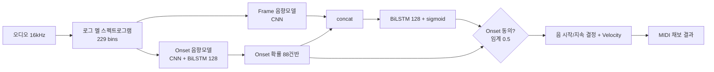

# Onsets and Frames: Dual-Objective Piano Transcription 분석 보고서

## 핵심 요약

이 논문은 다성(polyphonic) 피아노 음악의 자동 채보(Automatic Music Transcription, AMT) 문제를 딥러닝으로 푼 Google Magenta 팀의 대표적 연구다. 핵심 아이디어는 음의 **시작점(onset)** 을 전담하는 검출기와 음의 **지속 구간(frame)** 을 전담하는 검출기를 따로 학습시킨 뒤, 시작점 검출기의 출력을 지속 검출기의 추가 입력으로 흘려보내 두 목표를 결합(dual-objective)하는 것이다. 추론 시에는 시작점 검출기가 동의하지 않으면 새 음을 시작하지 못하도록 제약을 걸어, 짧고 어수선한 거짓 음(spurious notes)을 크게 줄였다.

이 단순하지만 강력한 설계로 MAPS 데이터셋에서 **offset까지 고려한 note F1 점수를 종전 대비 100% 이상 상대 향상**(50.22 vs. 종전 최고 23.14)시켰다([초록](https://arxiv.org/abs/1710.11153)). 또한 정규화된 오디오의 상대적 세기(velocity)를 함께 예측하도록 확장해 더 자연스러운 연주 재현을 가능하게 했다.

"Onsets and Frames"는 2018년 ISMIR에서 발표된 이후 피아노 AMT 분야의 사실상 표준 베이스라인이 되었다. 이후 등장한 ByteDance의 고해상도 회귀 모델(Kong 2021), Sony의 hFT-Transformer(2023) 등 거의 모든 후속 연구가 이 논문을 비교 기준으로 삼는다. AMT를 본격적인 딥러닝 과제로 끌어올린 분기점으로 평가된다.

## 서지 정보

저자는 Curtis Hawthorne, Erich Elsen, Jialin Song, Adam Roberts, Ian Simon, Colin Raffel, Jesse Engel, Sageev Oore, Douglas Eck이며 소속은 **Google Brain / Magenta** 팀이다. 논문은 2018년 [ISMIR(International Society for Music Information Retrieval) 학회](https://archives.ismir.net/ismir2018/paper/000019.pdf)에서 발표되었다. arXiv 사전 출판본은 [arXiv:1710.11153](https://arxiv.org/abs/1710.11153)(2017년 10월 최초 제출)이며, Magenta의 공식 구현과 커뮤니티 재구현([jongwook/onsets-and-frames](https://github.com/jongwook/onsets-and-frames) 등)이 공개되어 있다. 이후 같은 팀은 MAESTRO 데이터셋을 추가한 확장판을 ICLR 2019에서 발표했으나, 본 보고서가 다루는 ISMIR 2018 버전은 MAPS 데이터셋만 사용했다.

## 상세 요약

기존 프레임 단위(framewise) 분류 모델들의 약점은 "프레임 점수는 높지만 실제로 들어보면 엉망"이라는 점이었다. 짧게 깜빡이는 거짓 음이나 끊어져야 할 음이 이어지는 오류가 프레임 점수에는 거의 영향을 주지 않기 때문이다. 저자들은 사람의 음악 지각에서 **음의 시작 순간(onset)이 결정적으로 중요**하다는 점에 주목했다. 피아노 음은 타현 직후 에너지가 가장 크고 이후 감쇠하므로, onset 프레임은 식별이 비교적 쉽고 음 분할의 기준점이 된다.

이에 따라 모델은 두 개의 독립적 음향 모델(acoustic model)을 둔다. 하나는 **onset 검출 전용**, 다른 하나는 **frame(지속) 검출 전용**이다. onset 검출기는 합성곱(CNN) 음향 모델 뒤에 양방향 LSTM(128 units)과 88개 피아노 건반에 대응하는 sigmoid 출력층을 붙인다. frame 검출기는 별도의 음향 모델 출력을 onset 검출기의 출력과 이어 붙인(concatenate) 뒤 다시 양방향 LSTM(128 units)과 88-출력 sigmoid 층을 통과시킨다. 즉 onset 신호가 frame 예측을 **조건부로 안내(condition)** 한다.

추론 단계의 핵심 규칙은 "**onset 검출기가 동의하지 않으면 새 음을 시작하지 못한다**"는 것이다(임계값 0.5). 이로써 frame 검출기가 만들어내는 거짓 시작을 차단한다. 추가로 정규화된 오디오의 음 세기를 예측하는 velocity 분기를 두어, 재생 시 강약이 살아있는 자연스러운 MIDI를 출력한다. 손실 함수는 onset 손실과 frame 손실의 합(cross-entropy)이며, frame 손실에는 음 시작 직후 프레임에 더 큰 가중치(c = 5.0)를 주어 onset 부근 정확도를 높였다.

## 방법론과 데이터

입력은 16 kHz 오디오에서 추출한 로그 멜 스펙트로그램(229개 주파수 빈, FFT 2048, hop 512)이다. 학습 데이터는 **MAPS** 데이터셋으로, 합성된(synthesized) 피아노 곡을 학습에 쓰고 실제 야마하 Disklavier로 연주·녹음한 곡(ENSTDkCl/ENSTDkAm)을 테스트에 썼다. 곡이 학습/테스트에 중복되지 않도록 분리했다. 학습 시 오디오는 20초 단위로 잘라 배치를 구성했다.

| 항목 | 값 |
|---|---|
| 입력 표현 | 로그 멜 스펙트로그램 (log amplitude) |
| 멜 빈 수 | 229 |
| 샘플레이트 | 16 kHz |
| FFT 윈도우 / hop | 2048 / 512 |
| onset LSTM | 양방향 128 units |
| frame LSTM | 양방향 128 units |
| 출력 | 88 건반 × sigmoid |
| 추론 임계값 | 0.5 |
| onset 라벨 길이 | 32 ms |
| frame 초기 프레임 가중치 c | 5.0 |
| 옵티마이저 | Adam |
| 학습률 | 0.0006 |
| 그래디언트 클리핑 | L2-norm 3 |
| 배치 크기 | 8 |
| 학습 스텝 | 50,000 |
| 학습 시간 | 3× P100 GPU, 약 5시간 |

## 결과와 의의

아래는 MAPS 구성(합성 학습 → Disklavier 테스트)에서의 F1 점수다([ISMIR 2018 Table 1](https://archives.ismir.net/ismir2018/paper/000019.pdf)). Note는 onset만, Note w/ offset은 음 길이까지 맞춰야 정답으로 인정한다.

| 방법 | Frame F1 | Note F1 (onset) | Note w/ offset F1 | offset+velocity F1 |
|---|---|---|---|---|
| Sigtia et al. 2016 | 72.22 | 46.58 | 18.38 | — |
| Kelz et al. 2016 | 71.60 | 50.94 | 23.14 | — |
| Melodyne (상용) | 58.57 | 54.02 | 18.40 | 9.08 |
| **Onsets and Frames** | **78.30** | **82.29** | **50.22** | **35.39** |

가장 인상적인 것은 Note w/ offset F1이 종전 최고 23.14에서 50.22로 **두 배 이상 향상**된 점이다(초록의 "100% 이상 상대 향상"). onset 추론 제약을 제거한 절제(ablation) 실험에서는 note onset 점수가 약 18%, note-with-offset 점수가 약 31% 떨어져, "onset이 frame을 조건화한다"는 설계의 효과가 정량적으로 확인됐다. 추론 속도는 Tesla K40c에서 실시간 대비 70배 빨라 실용성도 갖췄다. 이 결과로 피아노 AMT는 신뢰할 만한 자동화 영역으로 진입했고, 이후 거의 모든 연구의 출발점이 되었다.

## 한계와 비판

첫째, **학습/테스트 모두 피아노에 한정**되며 합성음 학습·실연주 테스트라는 도메인 차이를 가정한다. 둘째, onset 임계값(0.5)에 의존하는 하드 규칙은 매우 여린 음(pp)이나 빠른 트릴에서 onset을 놓치면 음 전체를 누락시킬 수 있다. 셋째, frame 단위 출력이므로 **시간 해상도가 hop size(약 32 ms)에 묶여 있어** onset/offset 시각을 그보다 정밀하게 잡을 수 없다 — 이 한계는 후속 Kong et al. 2021의 회귀(regression) 방식이 정조준한 지점이다. 넷째, 라벨 정렬(label alignment)에 민감하여, 오디오-MIDI 정렬이 어긋나면 성능이 크게 흔들린다. 다섯째, **서스테인 페달**을 음 길이 연장으로 단순 변환할 뿐 페달 자체를 채보하지 않는다. 그럼에도 단순함과 재현성, 강력한 베이스라인으로서의 가치는 분야의 표준으로 남아 있다.
