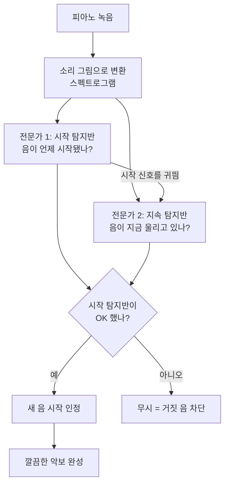

# Onsets and Frames: Dual-Objective Piano Transcription — 비전공자 해설

## 이 논문이 풀려는 문제는 무엇인가

피아노 연주를 녹음한 음원이 있다고 해봅시다. 이걸 듣고 "도-미-솔, 언제 누르고 언제 뗐는지"를 악보(MIDI)로 받아 적는 일을 컴퓨터에게 시키는 게 이 논문의 목표입니다. 사람이라면 귀 좋은 음악가가 받아쓰기(채보)를 하겠지만, 피아노는 한 번에 여러 음이 동시에 울리는 다성악기라 무척 어렵습니다. 마치 여러 사람이 동시에 말하는 시끄러운 방에서 누가 무슨 단어를, 정확히 몇 초에 말했는지 받아 적는 것과 같습니다.

기존 컴퓨터 방식의 가장 큰 문제는 이랬습니다. 음원을 아주 짧은 시간 조각(프레임)으로 잘라 "이 순간 이 건반이 눌려 있나?"를 매 조각마다 판단했는데, 그러다 보니 음이 짧게 깜빡거리거나(있다 없다 있다 없다) 끊겨야 할 음이 질질 이어지는 지저분한 결과가 나왔습니다. 채점표 숫자는 그럴듯해도 막상 들어보면 엉망이었죠.

## 한 줄 비유로 본 핵심

**"음표의 첫 글자(시작 순간)를 먼저 또박또박 받아 적고, 그 다음에 나머지를 채운다."** — 받아쓰기를 할 때 단어가 시작되는 순간만 놓치지 않으면 나머지는 훨씬 수월해지는 것과 같습니다.

## 핵심 아이디어를 한 그림으로

## 알아야 할 핵심 용어

| 용어 | 영문 | 직관적 설명 (비유 포함) |
|---|---|---|
| 자동 채보 | Automatic Music Transcription (AMT) | 녹음을 듣고 악보로 받아 적는 일. 음악 받아쓰기 |
| 온셋 | Onset | 음이 "처음 울리는 순간". 단어의 첫 글자에 해당 |
| 오프셋 | Offset | 음이 "끝나는 순간". 건반에서 손을 떼는 시점 |
| 프레임 | Frame | 소리를 잘게 자른 짧은 시간 조각. 영화 필름의 한 컷처럼 |
| 다성 | Polyphonic | 여러 음이 동시에 울리는 것. 합창단 비유 |
| 스펙트로그램 | Spectrogram | 소리를 "주파수 높낮이 × 시간"의 색깔 그림으로 바꾼 것 |
| 신경망 | Neural Network | 데이터를 보며 스스로 규칙을 배우는 컴퓨터 두뇌 |
| 벨로시티 | Velocity | 건반을 얼마나 세게 눌렀는지(음의 강약) |
| F1 점수 | F1 score | 정확도를 0~100으로 매긴 성적표. 높을수록 좋음 |

## 어떻게 작동하는가

1. **소리를 그림으로 바꾼다.** 녹음을 스펙트로그램이라는 컬러 그림으로 변환합니다. 가로는 시간, 세로는 음 높낮이, 색의 밝기는 그 음의 세기입니다. 컴퓨터는 소리보다 그림을 잘 분석합니다.

2. **두 명의 전문가를 둔다.** 한 명은 "음의 시작 순간"만 집중해서 찾는 시작 탐지 전문가, 다른 한 명은 "지금 이 음이 울리고 있나"를 보는 지속 탐지 전문가입니다. 둘은 각자 따로 훈련됩니다.

3. **시작 전문가가 지속 전문가에게 귀띔한다.** 시작 전문가가 "여기서 도 음이 시작됐어!"라고 알려주면, 지속 전문가는 그 정보를 참고해서 음의 길이를 추적합니다.

4. **결정적 규칙: 시작 전문가의 허락 없이는 새 음을 못 만든다.** 지속 전문가가 혼자 "음이 있는 것 같은데?"라고 해도, 시작 전문가가 동의하지 않으면 그 음은 기록하지 않습니다. 이 한 줄 규칙이 그동안 컴퓨터를 괴롭히던 "깜빡이는 거짓 음"을 싹 정리해줍니다.

5. **세기까지 받아 적는다.** 추가로 각 음을 얼마나 세게 쳤는지도 예측해서, 강약이 살아있는 자연스러운 연주로 복원합니다.

## 왜 중요한가

이 방법은 음의 길이(offset)까지 정확히 맞추는 가장 까다로운 항목에서 점수를 **두 배 이상** 끌어올렸습니다([논문](https://arxiv.org/abs/1710.11153)). 단순히 숫자만 좋아진 게 아니라, 실제로 들어봤을 때 사람이 친 연주처럼 깔끔해졌다는 점이 핵심입니다.

실생활로 보면, 좋아하는 피아노 연주 음원을 악보로 자동 변환하거나, 연습한 연주를 녹음해 어디서 틀렸는지 자동으로 비교하거나, 작곡가가 즉흥 연주를 그대로 MIDI로 받는 일이 가능해집니다. 무엇보다 이 "시작과 지속을 나눠서 풀고, 시작이 지속을 지휘한다"는 아이디어는 너무 명료하고 강력해서, 이후 등장한 거의 모든 피아노 채보 연구가 이 논문을 출발선이자 비교 기준으로 삼게 되었습니다. AMT를 실험실 호기심에서 쓸 만한 기술로 끌어올린 이정표 같은 연구입니다.
