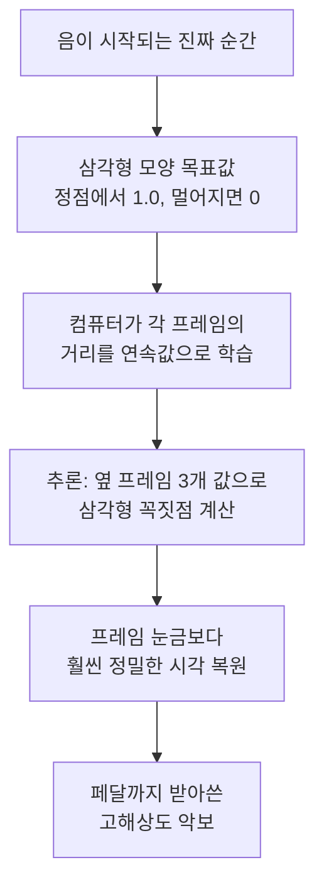

# High-Resolution Piano Transcription with Pedals — 비전공자 해설

## 이 논문이 풀려는 문제는 무엇인가

앞선 "Onsets and Frames" 같은 모델은 피아노 녹음을 악보로 잘 바꿔주지만, 한 가지 답답한 점이 있었습니다. 시간을 잴 때 **자(ruler)의 눈금이 너무 큼직했다**는 겁니다. 소리를 약 10밀리초(0.01초)짜리 조각으로 잘라서 분석하다 보니, "음이 정확히 언제 시작됐는지"를 그 눈금 안에서밖에 못 잡았습니다. 마치 1cm 단위 자로 길이를 재면 0.3cm 같은 정밀한 값은 절대 못 읽는 것과 같습니다.

또 하나, 학습에 쓰는 녹음과 악보 데이터가 미세하게 어긋나 있으면(사람이 만든 데이터는 늘 조금씩 어긋납니다) 기존 모델은 성적이 뚝 떨어졌습니다. 그리고 피아노에서 정말 중요한 **서스테인 페달**(소리를 길게 울리게 하는 오른쪽 발판)은 아예 받아 적지 못했습니다. 이 논문은 이 세 가지를 한꺼번에 해결합니다.

## 한 줄 비유로 본 핵심

**"눈금 칸 안에 '여기쯤'이 아니라, 자를 대고 정확한 지점을 계산해 찍는다."** — 칸을 더 잘게 나누는 대신, 양옆 값을 보고 삼각형 꼭짓점의 정확한 위치를 수학으로 풀어냅니다.

## 핵심 아이디어를 한 그림으로

## 알아야 할 핵심 용어

| 용어 | 영문 | 직관적 설명 (비유 포함) |
|---|---|---|
| 회귀 | Regression | "있다/없다"가 아니라 정확한 숫자(시각)를 맞히는 것. 키를 "크다/작다"가 아니라 173.2cm로 답하기 |
| 분류 | Classification | 보기 중 하나를 고르는 것. O/X 문제 |
| 온셋 / 오프셋 | Onset / Offset | 음이 시작되는 순간 / 끝나는 순간 |
| 프레임 | Frame | 소리를 자른 짧은 시간 조각(여기선 10ms). 자의 한 눈금 |
| 해상도 | Resolution | 얼마나 세밀하게 잴 수 있는가. 자의 눈금 촘촘함 |
| 서스테인 페달 | Sustain pedal | 밟으면 음이 길게 울리는 피아노 발판 |
| 라벨 정렬 | Label alignment | 녹음과 정답 악보의 시간이 정확히 맞춰진 정도 |
| 강건성 | Robustness | 입력이 조금 엉망이어도 결과가 안 흔들리는 성질 |
| 벨로시티 | Velocity | 건반을 누른 세기(강약) |
| F1 점수 | F1 score | 정확도 성적표(0~100). 높을수록 좋음 |

## 어떻게 작동하는가

1. **시작 순간에 삼각형 목표를 세운다.** "이 프레임이 진짜 시작 시각에서 얼마나 떨어졌나"를 삼각형 모양 숫자로 표현합니다. 정확히 시작하는 지점에서 값이 1.0으로 가장 높고, 시간상 멀어질수록 비탈처럼 0으로 내려갑니다.

2. **컴퓨터가 이 비탈을 통째로 학습한다.** "있다/없다"만 외우는 게 아니라 "얼마나 가까운가"라는 연속적인 거리 감각을 익힙니다.

3. **추론할 때 꼭짓점을 계산한다.** 실제로 받아 적을 때, 봉우리 프레임과 양옆 두 프레임의 값 세 개를 가지고 삼각형의 진짜 꼭짓점이 어디인지 간단한 산수로 풀어냅니다. 그러면 프레임 눈금보다 훨씬 정밀한 시각이 나옵니다.

4. **여러 전문가가 서로 돕는다.** 세기(velocity) 전문가가 시작 전문가를 돕고(여린 음 잡기에 유리), 시작·끝·지속 전문가의 정보가 합쳐져 최종 결과를 만듭니다.

5. **페달도 따로 받아 적는다.** 음을 받아쓰는 팀과 별개로, 같은 방식의 페달 전담팀이 페달을 언제 밟고 뗐는지 기록합니다.

## 왜 중요한가

첫째, **정밀도**입니다. 시간 허용 오차를 5밀리초처럼 아주 빡빡하게 줘도 기존 모델을 앞섭니다. 음악 편집·연구에서 "정확히 그 순간"이 필요할 때 큰 차이를 만듭니다.

둘째, **강건성**입니다. 학습 데이터가 살짝 어긋나 있어도 성능이 거의 안 떨어집니다([논문](https://arxiv.org/abs/2010.01815)). 기존 모델은 같은 조건에서 점수가 94점대에서 76점대로 폭락했지만, 이 모델은 96점대를 유지했습니다. 현실의 지저분한 데이터로도 잘 학습된다는 뜻이라 실무에서 매우 중요합니다.

셋째, **페달 채보**입니다. 페달은 피아노 연주의 표현력에서 빠질 수 없는데, 대규모로 이를 자동 채보한 최초의 사례입니다.

이 모델은 코드가 [공개](https://github.com/bytedance/piano_transcription)되어 누구나 쓸 수 있고, 이를 이용해 수많은 클래식 피아노 연주를 MIDI로 변환한 대형 데이터셋(GiantMIDI-Piano)까지 만들어졌습니다. 오늘날 "피아노 음원을 악보로 바꾸는" 실용 도구의 사실상 표준 중 하나로, 정밀하고 튼튼한 자동 채보가 무엇인지 보여준 연구입니다.
