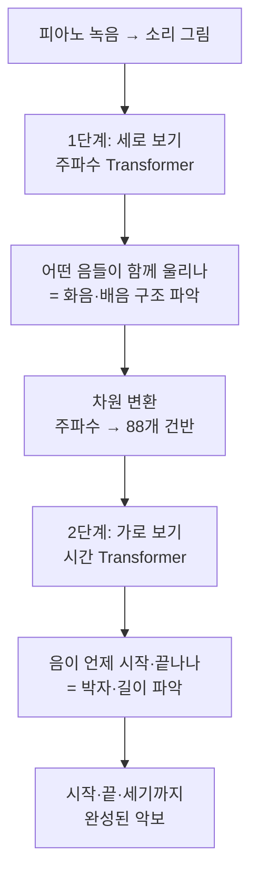

# Automatic Piano Transcription with Hierarchical Frequency-Time Transformer — 비전공자 해설

## 이 논문이 풀려는 문제는 무엇인가

피아노 녹음을 악보로 바꾸려면 컴퓨터가 두 가지를 동시에 잘해야 합니다. 하나는 "**어떤 음들이 같이 울리고 있나**"를 알아내는 것(세로, 즉 주파수 방향 보기), 다른 하나는 "**이 음이 언제 시작해서 언제 끝났나**"를 아는 것(가로, 즉 시간 방향 보기)입니다.

피아노 한 음을 누르면 기본음 말고도 여러 배음(딸려 울리는 높은 음들)이 함께 납니다. 그래서 "도"를 쳤는데 컴퓨터가 위쪽 배음을 보고 "어? 더 높은 음도 눌렸나?"하고 헷갈리기 쉽습니다. 또 음의 시작과 끝을 정확히 찍으려면 앞뒤로 꽤 긴 흐름을 봐야 합니다. 이 논문은 요즘 번역기·챗봇에 쓰이는 강력한 기술인 **Transformer**를 가져와, 주파수 방향과 시간 방향을 따로따로, 그리고 단계적으로 살펴보게 만들어 이 문제를 해결합니다.

## 한 줄 비유로 본 핵심

**"먼저 세로로 훑어 화음을 파악하고, 그 다음 가로로 훑어 박자를 파악한다 — 두 일을 분업한다."** — 합창단 사진을 볼 때, 먼저 "지금 누가 소리 내고 있나"를 한 열씩 보고, 그 다음 시간순으로 "언제 들어오고 빠지나"를 보는 식입니다.

## 핵심 아이디어를 한 그림으로

## 알아야 할 핵심 용어

| 용어 | 영문 | 직관적 설명 (비유 포함) |
|---|---|---|
| 트랜스포머 | Transformer | 챗봇·번역기에 쓰는 신경망. 멀리 떨어진 정보끼리 연결을 잘함 |
| 셀프 어텐션 | Self-attention | "어디에 주목할지" 스스로 가중치를 매기는 기능. 회의에서 핵심 발언에 귀 기울이기 |
| 계층형 | Hierarchical | 단계를 나눠 처리. 1단계 → 2단계로 순차 진행 |
| 주파수 축 | Frequency axis | 음의 높낮이 방향(세로) |
| 시간 축 | Time axis | 시간 흐름 방향(가로) |
| 인코더 / 디코더 | Encoder / Decoder | 정보를 요약하는 부분 / 원하는 형태로 바꿔 내보내는 부분 |
| 배음 | Harmonics | 한 음에 딸려 울리는 높은 음들. 종을 칠 때 함께 나는 울림 |
| 온셋 / 오프셋 | Onset / Offset | 음의 시작 / 끝 순간 |
| 벨로시티 | Velocity | 건반을 누른 세기(강약) |
| 파라미터 | Parameters | 모델의 "부품 수". 적을수록 가볍고 빠름 |
| F1 점수 | F1 score | 정확도 성적표(0~100). 높을수록 좋음 |

## 어떻게 작동하는가

1. **소리를 그림으로 바꾼다.** 녹음을 스펙트로그램(가로=시간, 세로=음 높낮이) 그림으로 만듭니다.

2. **1단계 — 세로로 본다.** 먼저 주파수 방향으로 Transformer가 훑으면서 "지금 어떤 음 높이들이 함께 울리고 있나"를 분석합니다. 이때 배음들이 어떻게 묶여 움직이는지를 파악해, 진짜 눌린 음과 딸려 나는 배음을 구별하는 데 도움을 줍니다.

3. **변환 — 주파수를 건반으로 바꾼다.** 그림의 세로 줄(256개 주파수 칸)을 실제 피아노 건반 88개에 대응하도록 깔끔하게 변환합니다.

4. **2단계 — 가로로 본다.** 이제 시간 방향으로 Transformer가 훑으면서 "각 음이 언제 시작해서 언제 끝나는지"의 긴 흐름을 파악합니다. 세로 분석과 가로 분석을 분업한 게 핵심입니다.

5. **네 가지를 한꺼번에 받아 적는다.** 음이 울리는 구간(frame), 시작(onset), 끝(offset), 세기(velocity)를 모두 출력합니다.

6. **경계를 다듬는다.** 소리를 토막 내 처리하면 토막의 양 끝이 부정확해지는데, 추론할 때 토막을 절반씩 겹쳐가며(half-stride) 가운데 부분만 채택해 정확도를 높입니다.

## 왜 중요한가

첫째, **성적이 최고**였습니다. 가장 널리 쓰는 두 데이터셋(MAESTRO, MAPS) 모두에서 모든 항목 1위를 기록했고, 특히 가장 까다로운 "음의 끝까지 정확히 맞히기"에서 큰 차이로 앞섰습니다([논문](https://arxiv.org/abs/2307.04305)).

둘째, **작은데 강합니다.** 부품 수(파라미터)가 5.5M으로, 26M짜리 Onsets and Frames나 54M짜리 다른 모델보다 훨씬 가벼우면서도 더 좋은 성적을 냈습니다. 가볍다는 건 더 적은 컴퓨터 자원으로 돌릴 수 있다는 뜻이라 실용적으로 중요합니다.

셋째, **새로운 설계 철학**을 보여줬습니다. "주파수와 시간을 한꺼번에 뭉뚱그리지 말고, 세로 따로 가로 따로 단계적으로 보자"는 아이디어가 효과적임을 입증했습니다. 챗봇·번역에서 위력을 떨친 Transformer가 음악 받아쓰기에서도 통한다는 것을 깔끔하게 증명한 셈입니다.

코드도 [공개](https://github.com/sony/hFT-Transformer)되어 있어 누구나 시험해볼 수 있습니다. 가볍고 정확한 자동 채보가 어디까지 가능한지 보여준, 최신 흐름을 대표하는 연구입니다.
