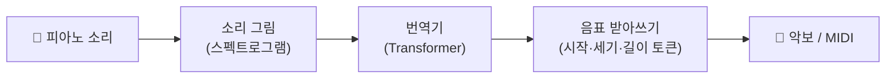

# Sequence-to-Sequence Piano Transcription with Transformers — 비전공자 해설

## 이 논문이 풀려는 문제는 무엇인가

피아노 연주를 녹음한 음원 파일이 있다고 해봅시다. 우리가 원하는 건 "어느 시점에, 어떤 건반을, 얼마나 세게, 얼마나 오래 눌렀는가"를 정확히 받아 적은 **악보(혹은 MIDI)**입니다. 사람이 귀로 듣고 손으로 옮겨 적는 이 작업을 컴퓨터에게 시키는 것이 자동 음악 채보(Automatic Music Transcription)입니다.

문제는, 그동안 이걸 잘하는 프로그램들이 하나같이 **음악 전용으로 손수 깎아 만든 복잡한 기계**였다는 점입니다. "음이 시작되는 순간을 잡는 부품", "음이 울리고 있는 구간을 잡는 부품", "세기를 잡는 부품"을 따로 만들고, 그 출력들을 "이럴 땐 음을 시작하고 저럴 땐 무시한다" 같은 규칙으로 일일이 짜맞춰야 했습니다. 성능은 좋았지만, 새 기능 하나 붙이려면 기계 전체를 다시 설계해야 하는 구조였죠.

이 논문은 정반대의 질문을 던집니다. **"굳이 음악 전용 기계를 만들 필요가 있을까? 번역기를 그대로 가져다 쓰면 안 될까?"**

## 한 줄 비유로 본 핵심

**채보를 "외국어 번역"처럼 다룬다.** 영어 문장을 한국어 문장으로 옮기듯, 이 모델은 "소리(스펙트로그램)"라는 언어를 "음표 기호(MIDI 토큰)"라는 언어로 번역합니다. 번역에 쓰이는 도구는 구글 번역기와 같은 계열의 범용 Transformer입니다 — 음악용으로 개조하지 않은, 그냥 "기성품" 번역 모델이죠.

## 핵심 아이디어를 한 그림으로

소리를 잘게 쪼개 "소리 그림"으로 바꾸고, 그걸 번역기에 넣으면, 음표를 묘사하는 토큰들이 한 개씩 차례로 튀어나옵니다. 마치 번역기가 단어를 하나씩 출력하듯이요.

## 알아야 할 핵심 용어

| 용어 | 영문 | 직관적 설명 |
|---|---|---|
| 자동 음악 채보 | Automatic Music Transcription (AMT) | 음원을 듣고 악보·MIDI로 받아 적는 일 |
| 스펙트로그램 | Spectrogram | 소리를 "시간 × 음높이"의 색깔 그림으로 펼친 것. 번역기의 입력 "언어" |
| 시퀀스 투 시퀀스 | Sequence-to-Sequence (seq2seq) | 입력 줄(소리)을 출력 줄(음표)로 통째로 옮기는 번역 방식 |
| 트랜스포머 | Transformer | 번역·챗봇에 쓰이는 범용 신경망. 문장 전체를 한눈에 보는 "어텐션"이 핵심 |
| MIDI-유사 토큰 | MIDI-like tokens | 음표의 시작/세기/시각을 나타내는 단어 같은 기호들 |
| 온셋 | Onset | 음이 "시작되는" 순간. 피아노에선 가장 중요하고 잡기 쉬운 정보 |
| 절대 시간 | Absolute time | "녹음 시작 후 0.42초"처럼 시각을 그 자체로 표기(오차 누적 방지) |
| F1 점수 | F1 score | 맞힌 정도를 0~100%로 나타낸 채점표. 높을수록 정확 |

## 어떻게 작동하는가

1. **소리를 그림으로**: 피아노 음원을 16kHz로 받아, 짧은 구간마다 주파수 성분을 분석해 "로그 mel 스펙트로그램"이라는 가로(시간)×세로(음높이) 그림으로 만듭니다.

2. **번역기에 통째로 입력**: 이 그림 조각들을 Transformer 인코더가 한꺼번에 살펴봅니다(어텐션). 그러면 "여기쯤에 어떤 음들이 어떻게 울리는지"에 대한 압축된 이해가 만들어집니다.

3. **음표 토큰을 한 개씩 출력**: 디코더가 이 이해를 바탕으로 "0.42초에 / 미들 C 음을 / 켜라" 같은 토큰을 하나씩 차례로 뱉습니다. 매 단계 가장 그럴듯한 토큰 하나를 고르는 단순한 방식(greedy)으로요.

4. **똑똑한 시간 표기**: "직전 음으로부터 0.1초 뒤"처럼 상대적으로 적으면 초반의 작은 실수가 뒤로 갈수록 눈덩이처럼 커집니다. 그래서 이 모델은 **항상 "구간 시작점부터 몇 ms"**라는 절대 시각을 적습니다. 덕분에 한 음이 틀려도 나머지가 줄줄이 어긋나지 않습니다.

5. **조각을 이어 붙이기**: 긴 곡은 약 4초 단위로 잘라 따로 번역한 뒤, 결과를 이어 붙여 한 곡의 MIDI로 완성합니다.

놀라운 점은, **출력 라벨만 바꾸면** 같은 모델이 "음 시작만 받아쓰기" 같은 다른 작업으로 즉시 변신한다는 것입니다. 기계를 새로 설계할 필요가 없습니다.

## 왜 중요한가

이 논문은 "음악 채보는 음악 전문가가 손수 만든 특수 기계라야 잘한다"는 통념을 뒤집었습니다. **범용 번역 모델이, 전용 모델과 맞먹거나 더 나은 성적**(MAESTRO에서 Onset F1 95.95%, 세기까지 따지는 가장 어려운 기준에서 82.18%로 당시 최고)을 냈으니까요. 게다가 모델은 54M 파라미터로 작았고, 일부러 키우자 오히려 과적합으로 나빠졌습니다 — "큰 게 능사는 아니다"라는 교훈입니다.

가장 큰 파급력은 **연구의 방향을 바꾼 것**입니다. "더 정교한 음악 전용 모델을 설계하자"에서 "좋은 데이터를 모으고 입출력 토큰만 잘 정의하자"로요. 이 단순하고 유연한 틀은 곧바로 여러 악기를 한꺼번에 받아 적는 **MT3**로 확장되었고, 다시 보컬까지 직접 채보하는 **YourMT3+**로 이어집니다. 즉 이 논문은 현대 다중악기 채보 모델 계보의 **출발점**입니다.
