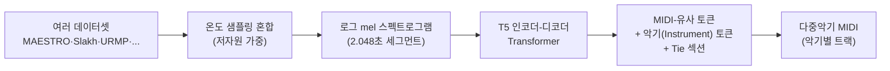

# MT3: Multi-Task Multitrack Music Transcription 분석 보고서

## 핵심 요약

MT3는 Hawthorne et al.(2021)의 seq2seq 피아노 채보를 **임의 개수의 악기를 동시에 받아 적는 다중악기·다중트랙(multitrack) 채보**로 확장한 논문이다. 음성 인식(ASR)이 보통 한 화자의 단어만 받아 적는 것과 달리, 음악 채보는 여러 악기를 동시에 다루면서도 미세한 음높이와 타이밍을 보존해야 한다. 게다가 전문 음악가조차 채보가 어려워 데이터셋이 대부분 "저자원(low-resource)"이라는 근본적 한계가 있다.

저자들은 NLP의 다국어 모델(mT5)이 저자원 언어에서 전이학습으로 큰 이득을 보는 데 착안하여, **단일 범용 Transformer 하나로 여러 데이터셋·여러 악기 조합을 한꺼번에 학습**시킨다. 핵심 장치는 General MIDI의 128개 "프로그램(악기)"에 대응하는 **악기 토큰(Instrument token)**을 출력 어휘에 추가한 것으로, 이로써 데이터셋마다 다른 악기 구성을 하나의 출력 표현으로 통합한다.

결과적으로 이 통합 학습은 **저자원 악기에서 극적인 성능 향상**을 가져왔다. 데이터가 1.3시간뿐인 URMP에서 Onset+Offset F1이 단일 학습 대비 **263%** 증가했고, MusicNet에서 **54%**, GuitarSet에서 19.5% 향상되었다. 동시에 데이터가 풍부한 피아노(MAESTRO)에서는 소폭(약 -5%) 손실에 그쳤다. 저자들은 또한 "어느 악기가 어느 음을 연주했는가"까지 채점하는 **다중악기 F1(multi-instrument F1)** 지표를 새로 제안하며, 다중악기 AMT를 위한 일관된 평가 기준과 데이터 정렬의 필요성을 제기했다.

## 서지 정보

- **제목**: MT3: Multi-Task Multitrack Music Transcription
- **저자**: Josh Gardner, Ian Simon, Ethan Manilow, Curtis Hawthorne, Jesse Engel
- **소속**: Google Research, Brain Team. (Josh Gardner — University of Washington, Paul G. Allen School, Google 인턴 중 수행 / Ethan Manilow — Northwestern University, Interactive Audio Lab, Google Student Researcher 중 수행)
- **발표처**: International Conference on Learning Representations (ICLR) 2022.
- **arXiv**: [2111.03017](https://arxiv.org/abs/2111.03017) · **OpenReview**: [iMSjopcOn0p](https://openreview.net/pdf?id=iMSjopcOn0p)
- **코드**: [github.com/magenta/mt3](https://github.com/magenta/mt3) · **데모**: [storage.googleapis.com/mt3](https://storage.googleapis.com/mt3/index.html)

## 상세 요약

MT3는 Hawthorne 2021과 마찬가지로 채보를 **"스펙트로그램 → MIDI-유사 토큰" 번역**으로 다루되, 출력 어휘를 다중악기로 일반화한다. 가장 중요한 변화는 **악기(Instrument) 토큰의 도입**이다. 128개 값(General MIDI 프로그램 수에 대응)을 가지며, "이 토큰 이후의 음 이벤트는 이 악기에 속한다"고 지정한다. 이로써 피아노만 있는 MAESTRO, 기타만 있는 GuitarSet, 4~48개 악기가 섞인 Slakh2100을 **하나의 토큰 체계**로 표현할 수 있다.

또 다른 변화는 (1) **velocity 제거** — 대부분의 데이터셋이 세기 라벨을 표준적으로 제공하지 않기 때문, (2) **타이(tie) 섹션 도입** — 세그먼트를 독립적으로 디코딩하는 구조상 세그먼트 경계를 넘는 음을 처리하기 위함이다. 각 세그먼트 시작에서 모델은 "이미 울리고 있는 음들"을 먼저 선언(Program·Pitch 토큰)한 뒤 End Tie Section 토큰을 내보낸다. 이어 붙일 때 선언되지 않은 음은 종료시켜, 경계 처리가 우아하게 실패하도록(fail gracefully) 한다.

핵심 학습 전략은 **여러 데이터셋을 한 배치 안에 섞는 mixing**이다(채보 문헌에서 처음 시도). 데이터 양 불균형을 보정하기 위해 mT5처럼 **온도 샘플링(temperature sampling)**을 적용한다. 데이터셋 i를 (n_i / Σn_j)^0.3 확률로 샘플링하여, 저자원 데이터셋의 등장 빈도를 높이고 고자원 데이터셋을 낮춘다. 시간은 Hawthorne 2021과 동일하게 **10ms 단위 절대 시간**으로 양자화한다.

## 방법론과 데이터

모델은 T5 "small"(T5.1.1 레시피) 인코더-디코더로, Hawthorne 2021과 사실상 동일한 백본을 쓴다. 본문은 약 60M 파라미터로 기술하나 아키텍처 표(임베딩 포함)는 93.7M로 표기된다. 입력은 로그 mel 스펙트로그램, 세그먼트 길이는 2.048초(비중첩)다. 모델이 작은 이유는 "크게 키우면 과적합이 심해졌기" 때문이다. 학습은 mixture 모델 1M step, 단일 데이터셋 모델 2^19 step.

| 데이터셋 | 오디오(시간) | 곡 수 | 악기 종류 | 곡당 악기 | 정렬 품질 | 저자원 |
|---|---|---|---|---|---|---|
| Slakh2100 | 968.5 | 1405 | 35 | 4–48 | 우수 | — |
| Cerberus4 | 542.6 | 1327 | 4 | 4 | 우수 | — |
| MAESTROv3 | 198.7 | 1276 | 1 (피아노) | 1 | 우수 | — |
| MusicNet | 34 | 330 | 11 | 1–8 | 미흡(DTW) | ✓ |
| GuitarSet | 3 | 360 | 1 (기타) | 1 | 우수 | ✓ |
| URMP | 1.3 | 44 | 14 | 2–5 | 보통 | ✓ |

(출처: 논문 Table 1. Cerberus4는 Slakh2100에서 기타·베이스·드럼·피아노 4종을 조합해 파생)

## 결과와 의의

핵심 메시지는 **혼합 학습(mixture)이 저자원 악기를 살린다**는 것이다. 아래는 가장 까다로운 Onset+Offset F1에서 단일 데이터셋 학습 대비 혼합 학습의 변화다.

| 지표(Onset+Offset F1) | MAESTRO | Cerberus4 | GuitarSet | MusicNet | Slakh2100 | URMP |
|---|---|---|---|---|---|---|
| MT3 (단일 학습) | 0.8431 | 0.7584 | 0.6546 | 0.2143 | 0.5724 | 0.1589 |
| MT3 (혼합 학습) | 0.7987 | 0.7977 | 0.7822 | 0.3301 | 0.5727 | 0.5776 |
| 상대 변화 | **-5.3%** | +5.2% | +19.5% | **+54%** | +0.1% | **+263%** |

참고로 Onset F1(혼합) 기준 URMP 0.77, GuitarSet 0.895, MusicNet 0.5016이며, MAESTRO는 0.9455로 단일 학습 0.9601 대비 소폭 하락에 그친다(출처: 논문 Table 2). MT3는 6개 데이터셋 모두에서 세 가지 표준 지표(Frame/Onset/Onset+Offset F1) 기준 당시 최첨단을 넘어섰고, 상용 도구 Melodyne도 전 항목에서 능가했다.

저자들은 **다중악기 F1**을 새로 제안했다. 이는 Onset+Offset F1 조건에 "예측한 악기가 정답 악기와 일치해야 한다"는 요건을 추가한 더 엄격한 지표다. 세 가지 악기 분류 입도(Flat / MIDI Class / Full program)로 측정한 결과, Full 입도에서도 점수가 Onset+Offset F1과 가깝게 유지되어(예: MAESTRO 0.8164, Cerberus4 0.7577, Slakh2100 0.5453) "onset/offset을 맞히면 악기 라벨은 거의 틀리지 않는다"는 점을 보였다.

의의는 **단일 모델로 다중악기·다중데이터셋 채보를 통합**하고, 저자원 문제를 전이학습으로 완화하는 길을 연 것이다. 이는 YourMT3+ 등 후속 다중악기 모델의 직접적 기반이 되었다.

## 한계와 비판

- **데이터 절대량 부족**: 저자들은 "본 논문이 쓴 모든 AMT 데이터셋을 합쳐도 LibriSpeech 한 개보다 오디오 시간이 적다"고 지적한다. AMT는 본질적으로 저자원이며, 자기지도·반지도 학습이 향후 과제다.
- **평가 일관성 부재**: 문헌마다 지표·테스트 분할이 제각각이라 비교가 어렵다. 저자들이 표준 분할과 일관된 음표 기반 지표를 정의했으나, 기존 베이스라인 수치가 부풀려졌을 가능성을 인정한다.
- **데이터 정렬 품질 편차**: MusicNet은 DTW 기반 정렬로 "미흡", URMP는 "보통" 수준이라 라벨 품질이 성능 상한을 제약한다.
- **고자원 악기의 소폭 희생**: 혼합 학습은 저자원에서 크게 이득이지만 MAESTRO(피아노)에서 약 5% 손실이 발생한다(유일한 회귀).
- **서양 음악 한정**: 12개 이산 음계(평균율)를 전제하므로 인도 라가, 아랍 마캄, 미분음 블루스 등은 대상에서 제외된다는 윤리·범위 한계를 명시했다.
- **세그먼트 독립 디코딩**: Hawthorne 2021에서 물려받은 약 2초 세그먼트 분할 구조로, 악기 간 누설(instrument leakage) 등 후속 연구(MR-MT3)가 지적하는 문제를 안고 있다.
