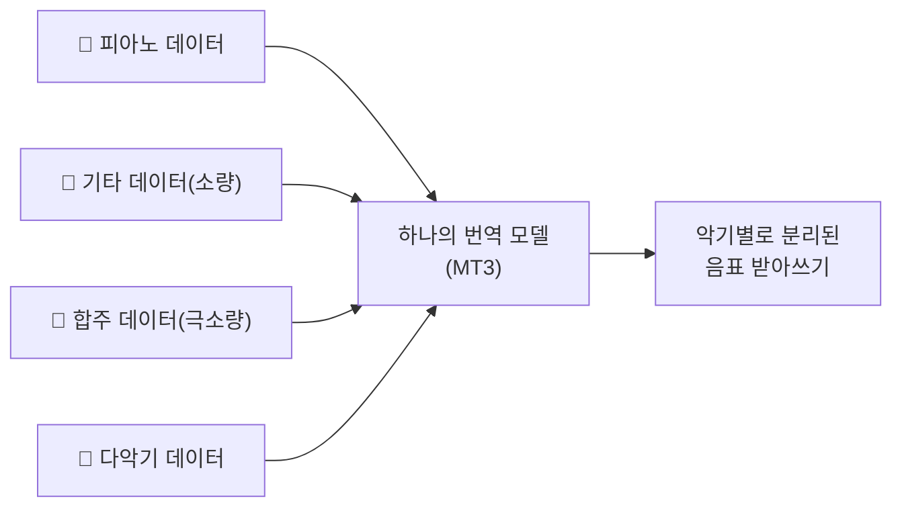

# MT3: Multi-Task Multitrack Music Transcription — 비전공자 해설

## 이 논문이 풀려는 문제는 무엇인가

앞선 연구(Hawthorne 2021)는 **피아노 한 대**의 연주를 악보로 받아 적는 데 성공했습니다. 그런데 실제 음악은 보통 여러 악기가 동시에 울립니다 — 밴드라면 기타, 베이스, 드럼, 건반이 한꺼번에 섞이죠. 채보기에게 진짜 어려운 건 이 **뒤섞인 소리에서 "어느 악기가 무슨 음을 언제 쳤는지" 동시에 분리해 받아 적는 일**입니다.

여기에 또 하나의 골칫거리가 있습니다. **데이터가 너무 적습니다.** 전문 음악가조차 채보가 오래 걸리고 어렵기 때문에, 악기별로 정답이 달린 음악 데이터셋은 매우 빈약합니다. 특히 기타 데이터는 3시간, 합주(URMP) 데이터는 고작 1.3시간뿐입니다. 이렇게 적은 데이터로는 좋은 모델을 못 만든다는 게 통념이었죠.

MT3는 이 두 문제를 한 번에 공격합니다. **"악기마다 따로 모델을 만들지 말고, 여러 악기·여러 데이터셋을 한 모델에 몽땅 섞어 가르치자."**

## 한 줄 비유로 본 핵심

**"다국어를 함께 배우면 희귀 언어 실력도 는다."** 한 사람이 영어·스페인어·라틴어를 같이 배우면, 데이터가 적은 라틴어 실력이 영어 덕분에 덩달아 좋아집니다. MT3도 마찬가지로 피아노·기타·합주를 한 모델에 함께 가르치자, 데이터가 빈약한 기타와 합주의 채보 실력이 **극적으로** 좋아졌습니다.

## 핵심 아이디어를 한 그림으로

여러 종류의 데이터를 한 솥에 넣고 함께 끓이면, 데이터가 적은 악기가 풍부한 악기의 "공통 지식"을 빌려 씁니다.

## 알아야 할 핵심 용어

| 용어 | 영문 | 직관적 설명 |
|---|---|---|
| 다중악기 채보 | Multi-instrument transcription | 여러 악기가 섞인 음악을 악기별로 받아 적기 |
| 멀티트랙 | Multitrack | 악기마다 별도 트랙(줄)으로 정리된 결과 |
| 악기 토큰 | Instrument token | "다음 음들은 기타 소리다"라고 표시하는 꼬리표 (128종) |
| 저자원 | Low-resource | 정답 데이터가 매우 적은 상황 (기타 3h, 합주 1.3h) |
| 전이학습 | Transfer learning | 풍부한 데이터에서 배운 지식을 빈약한 쪽에 빌려주기 |
| 데이터 혼합 | Mixing | 여러 데이터셋을 한 배치에 섞어 동시에 학습 |
| 온도 샘플링 | Temperature sampling | 소량 데이터를 더 자주 뽑아 균형을 맞추는 기법 |
| 타이 섹션 | Tie section | 구간 경계를 넘는 긴 음을 끊기지 않게 잇는 장치 |
| F1 점수 | F1 score | 정확도 채점표(0~100%). 높을수록 좋음 |

## 어떻게 작동하는가

1. **여러 데이터셋을 한 솥에**: 피아노만 있는 MAESTRO(약 200시간), 다악기 합성곡 Slakh(약 968시간), 기타(3시간), 합주(1.3시간) 등 6개 데이터셋을 함께 사용합니다.

2. **불균형 바로잡기**: 그냥 섞으면 데이터가 많은 피아노만 잘 배우게 됩니다. 그래서 **데이터가 적은 셋을 일부러 더 자주 뽑아** 학습 기회를 균형 있게 줍니다(온도 샘플링).

3. **"악기 꼬리표"로 구분**: 출력 토큰에 **악기 토큰**을 추가한 게 핵심 발명입니다. "여기서부터는 기타", "여기서부터는 베이스" 식으로 꼬리표를 달면, 한 모델이 어떤 악기 조합이든 같은 방식으로 받아 적을 수 있습니다. 표준 MIDI의 128가지 악기 번호를 그대로 빌려 썼습니다.

4. **긴 음 잇기**: 곡을 약 2초 단위로 잘라 처리하다 보면 한 음이 두 구간에 걸칠 수 있습니다. 각 구간 시작에서 "이미 울리고 있는 음"을 먼저 선언하게 해서(타이 섹션) 음이 어색하게 끊기지 않도록 합니다.

5. **결과**: 한 번 학습된 단일 모델이 피아노든 기타든 4중주든, 입력만 주면 악기별로 분리된 MIDI를 출력합니다.

## 왜 중요한가

가장 인상적인 성과는 **저자원 악기의 부활**입니다. 데이터가 1.3시간뿐인 합주(URMP)에서 채보 정확도(Onset+Offset F1)가 혼자 배울 때보다 **263% 뛰었고**, 클래식 합주(MusicNet)는 54%, 기타는 19.5% 좋아졌습니다. 반면 데이터가 넘치는 피아노는 약 5%만 손해 봤습니다 — 잃은 것보다 얻은 게 압도적으로 큽니다. MT3는 6개 데이터셋 전부에서 당시 최고 기록과 상용 도구(Melodyne)를 모두 넘어섰습니다.

또한 MT3는 채점 방식 자체도 개선했습니다. 기존 지표는 "음을 맞혔는가"만 봤지만, 다중악기에서는 **"그 음을 친 악기까지 맞혔는가"**가 중요합니다. 그래서 저자들은 악기 일치까지 따지는 더 엄격한 **다중악기 F1**을 새로 제안했습니다.

결국 MT3는 "악기마다 전용 모델을 만든다"는 시대를 끝내고, **하나의 범용 모델이 모든 악기를 받아 적는** 새 방향을 열었습니다. 이 틀은 곧 보컬까지 직접 받아 적는 **YourMT3+**로 발전하게 됩니다 — MT3는 그 다리 역할을 한 셈입니다.
