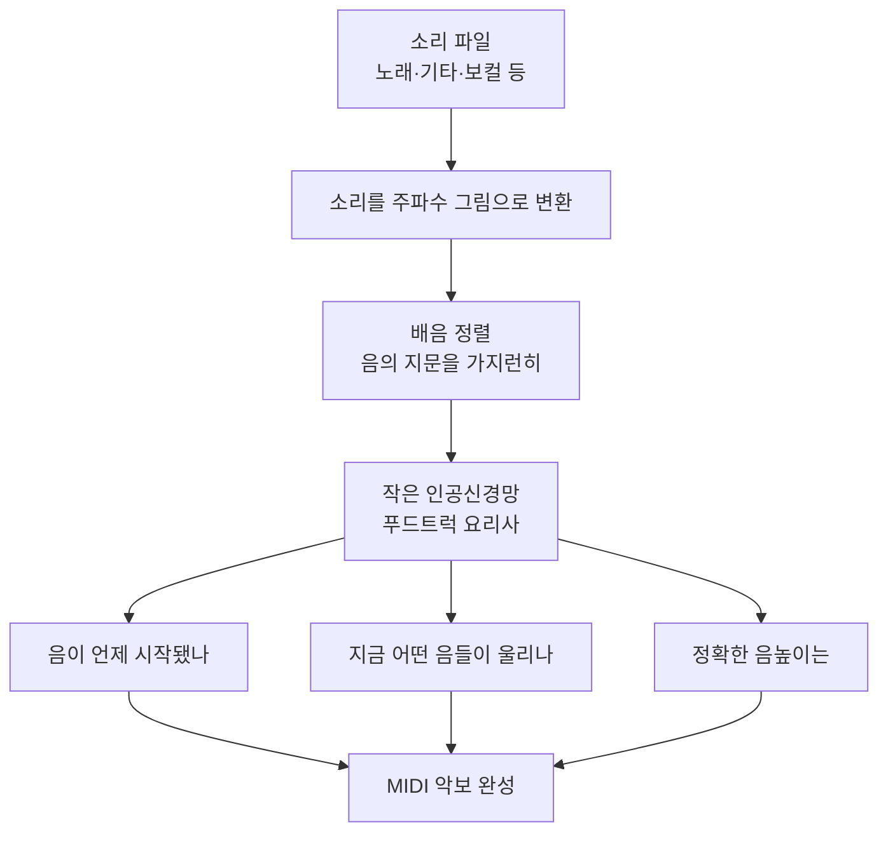

# Basic Pitch (가벼운 악기 무관 음표 채보 모델) — 비전공자 해설

## 이 논문이 풀려는 문제는 무엇인가

기타로 멜로디를 즉흥 연주하다가 "방금 그거 악보로 적어두고 싶다"고 생각해 본 적 있을 것이다. 사람은 귀로 듣고 손으로 악보를 받아 적는데, 이걸 컴퓨터가 자동으로 해주는 기술을 **자동 음악 채보(Automatic Music Transcription, AMT)** 라고 한다. 오디오(소리)를 넣으면 MIDI(컴퓨터가 이해하는 악보 데이터)가 나오는 것이다.

문제는, 지금까지의 "잘 받아 적는 컴퓨터"들이 하나같이 **편식쟁이**였다는 점이다. 피아노만 잘 받아 적는 모델, 기타만 잘 받아 적는 모델이 따로 있었고, 각각이 덩치도 크고 무거웠다. 식당에 비유하면, 김치찌개 전문점·파스타 전문점·초밥 전문점을 따로 운영하는 셈이다. 각 가게는 자기 메뉴는 끝내주게 하지만, 가게를 다 차리려면 돈과 공간이 엄청나게 든다. 휴대폰 앱이나 웹사이트에 이 무거운 모델 여러 개를 다 넣는 건 비현실적이다.

Spotify 연구팀은 정반대로 묻는다. "악기를 가리지 않고, 작고 가벼우면서도, 쓸 만한 정확도를 내는 만능 모델 하나면 안 될까?" 그렇게 나온 것이 **Basic Pitch**다.

## 한 줄 비유로 본 핵심

> **Basic Pitch는 "여러 전문 식당" 대신, 작은 푸드트럭 한 대로 웬만한 메뉴를 다 그럭저럭 맛있게 내주는 만능 요리사다.** 미슐랭 3스타만큼은 아니어도, 어디서나 즉석에서 꺼내 쓸 수 있을 만큼 가볍다.

## 핵심 아이디어를 한 그림으로

## 알아야 할 핵심 용어

| 용어 | 영문 | 직관적 설명 |
| --- | --- | --- |
| 자동 음악 채보 | Automatic Music Transcription (AMT) | 소리를 듣고 악보(음표)로 받아 적는 기술 |
| 악기 무관 | Instrument-Agnostic | 피아노든 기타든 보컬이든 가리지 않고 처리 |
| 다성음 | Polyphonic | 동시에 여러 음이 울리는 화음·코드까지 처리 |
| 음 시작 | Onset | 음표가 "딱" 시작되는 순간 |
| 다중 음높이 추정 | Multipitch Estimation | 매 순간 어떤 음높이들이 울리는지 동시에 추정 |
| 배음 정렬 | Harmonic Stacking | 한 음에 딸려오는 배음들을 가지런히 정렬해 인식을 돕는 기법 |
| MIDI | MIDI | 음표·시작·길이·세기를 담은 디지털 악보 데이터 |
| 피치 벤드 | Pitch Bend | 음을 살짝 휘어 올리거나 내리는 표현(기타 벤딩 등) |

## 어떻게 작동하는가

1. **소리를 "그림"으로 바꾼다.** 컴퓨터는 소리를 그대로 보지 못하므로, 먼저 시간에 따라 어떤 주파수가 강한지를 보여주는 **주파수 그림(스펙트로그램 계열 표현)** 으로 변환한다. 가로축은 시간, 세로축은 음높이라고 생각하면 된다.

2. **음의 "지문"을 가지런히 정렬한다(harmonic stacking).** 어떤 음을 연주하면 그 음만 울리는 게 아니라, 위쪽으로 일정한 간격의 **배음**이 함께 울린다. 이 배음 패턴이 곧 그 음의 지문이다. Basic Pitch는 이 배음들을 차곡차곡 겹쳐 정렬해서, 작은 신경망이 "아, 이 지문은 이 음이구나"를 쉽게 알아채도록 한다. 덩치를 키우지 않고도 똑똑해지는 핵심 비결이다.

3. **세 가지를 한꺼번에 본다.** 모델은 (1) 음이 언제 시작됐는지, (2) 지금 이 순간 어떤 음들이 울리는지, (3) 그 음높이가 정확히 어디인지를 **동시에** 예측한다. 세 가지를 따로따로가 아니라 함께 학습하면 서로 힌트를 주고받아 결과가 더 정확해진다는 것이 이 논문의 발견이다.

4. **음표로 조립하고 MIDI로 내보낸다.** 마지막으로 "음 시작" 정보와 "음 지속" 정보를 합쳐 개별 음표를 만들고, 미세한 음높이 변화(피치 벤드)까지 담아 MIDI 파일로 저장한다.

이 모든 게 **파라미터 약 1만 7천 개 미만, 메모리 20MB 미만**이라는 아주 작은 모델에서 이뤄진다. 요즘 AI 모델들이 수억~수십억 개 파라미터를 쓰는 것과 비교하면 거의 장난감 크기인데, 성능은 결코 장난감이 아니다.

## 왜 중요한가

Basic Pitch가 중요한 이유는 **AMT를 모두의 손에 쥐어줬다**는 점이다.

- **누구나 쓴다**: `pip install basic-pitch` 한 줄이면 설치되고, 웹사이트 [basicpitch.io](https://basicpitch.io)에 음원을 올리면 브라우저에서 바로 MIDI를 받을 수 있다. 무겁고 비싼 GPU가 필요 없다.
- **어디서나 돈다**: macOS·Windows·Linux는 물론 휴대폰·웹브라우저에서도 동작하도록 여러 형식으로 변환되어 있다.
- **만든 곡을 편집한다**: 흥얼거린 멜로디나 기타 리프를 MIDI로 바꿔 작곡 소프트웨어에서 다듬을 수 있다. 음악 교육·창작·연구의 진입 장벽을 크게 낮췄다.

물론 약점도 있다. **한 번에 한 악기**일 때 가장 잘 동작하므로, 드럼·베이스·보컬이 한꺼번에 섞인 완성곡에 그냥 넣으면 헷갈려 한다. 또 피아노 전용 고정밀 모델만큼 세밀하지는 않다. 하지만 "작아도 충분히 쓸 만하다"는 것을 보여준 덕분에, 이후 "먼저 보컬만 깔끔히 분리한 뒤 채보하자"는 발상(Mel-RoFormer 등)으로 이어졌다. Basic Pitch는 음악 AI의 대중화를 연 작지만 단단한 디딤돌인 셈이다.
