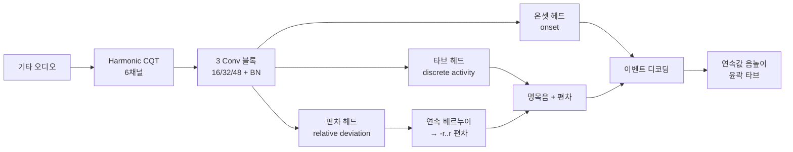

# FretNet: Continuous-Valued Pitch Contour Streaming for Polyphonic Guitar Tablature Transcription 분석 보고서

## 핵심 요약

FretNet은 기타 타브 채보(Guitar Tablature Transcription, GTT)에서 음높이를 정수(반음 격자)로 양자화하지 않고 **연속값 음높이 윤곽(continuous-valued pitch contour)** 으로 추정하는 종단간(end-to-end) 시스템이다. 기존 자동 채보(AMT) 모델은 음높이를 서양 음계의 명목 음(nominal pitch)으로 양자화하는데, 이는 벤딩(bend)·슬라이드(slide)·비브라토(vibrato)처럼 **음높이를 변조(pitch modulation)** 하는 기타 주법을 표현하지 못한다. 더 높은 해상도를 얻으려면 출력 차원을 키우고 모델을 복잡하게 만들어야 했다.

FretNet의 핵심 아이디어는 각 현·프렛 쌍마다 **(1) 이산적 활성도(discrete activity)** 와 **(2) 명목 음 대비 상대적 음높이 편차(relative pitch deviation)** 를 분리해서 추정하는 것이다. 활성도 뉴런은 "이 자리에서 음이 울리는가"라는 음악적 사건(note)을 담당하고, 편차 뉴런은 "그 음이 명목 음에서 반음 단위로 얼마나 벗어났는가"를 연속값으로 담당한다. 편차 출력은 **연속 베르누이 분포(Continuous Bernoulli distribution)** 로 모델링한다. 이렇게 하면 현·프렛 쌍당 **단 하나의 추가 뉴런** 으로 무한 해상도의 음높이를 얻을 수 있어, 모델 복잡도를 상수만큼만 늘리고도 다중음 추정(MPE) 해상도를 크게 끌어올린다.

GuitarSet 6-fold 교차검증에서 FretNet은 프레임 레벨 타브 추정(F1 0.727)과 다중음 추정(F1 0.818)에서 TabCNN과 대등하거나 약간 우수했고, 무엇보다 **음표 레벨(note-level)** 성능과 **저허용오차(고해상도) 연속 음높이 추정**에서 큰 격차로 앞섰다. 모든 수치는 클린한 GuitarSet 한정이다.

## 서지 정보

- **제목:** FretNet: Continuous-Valued Pitch Contour Streaming for Polyphonic Guitar Tablature Transcription
- **저자:** Frank Cwitkowitz, Toni Hirvonen, Anssi Klapuri
- **소속:** University of Rochester (Cwitkowitz), Yousician (Hirvonen, Klapuri). 본 연구는 Cwitkowitz가 Yousician 인턴 중 수행.
- **발표처:** ICASSP 2023 (IEEE International Conference on Acoustics, Speech and Signal Processing), Rhodes Island, Greece
- **연도:** 2023
- **arXiv:** [arXiv:2212.03023](https://arxiv.org/abs/2212.03023)
- **소스 코드(GitHub):** [github.com/cwitkowitz/guitar-transcription-continuous](https://github.com/cwitkowitz/guitar-transcription-continuous)

## 상세 요약

자동 음악 채보(AMT)는 보통 두 하위 작업의 결합으로 본다: **다중음 추정(MPE, Multi-Pitch Estimation)** 은 프레임마다 울리는 음높이들을 추정하고, **노트 트래킹(NT, Note Tracking)** 은 이 프레임 활성도를 음표(note)로 묶는다. 전통적 정식화에서는 MPE가 음높이를 반음 격자로 양자화하기 때문에 음악적 표현의 뉘앙스를 잃고, NT는 음높이가 변하는 사건을 기술하기에 부적합하다. 기타는 이 문제가 특히 두드러지는 악기다 — 벤딩·슬라이드 등 음높이를 휘게 하고 음표 경계를 흐리는 주법이 풍부하기 때문이다.

FretNet의 백본은 TabCNN에서 영감을 받되 더 깊어졌고, 선행 연구(Cwitkowitz et al., SMC 2022)의 타브 출력층 개선(현 묵음의 명시적 모델링, 억제 손실 inhibition loss)을 채택했다. 입력 특징은 TabCNN의 단일 CQT 대신 **Harmonic CQT(HCQT)** 를 쓴다 — 기본 주파수와 그 배음/하모닉에 맞춘 여러 CQT를 채널로 쌓아, 합성곱이 배음 정보를 활용하도록 유도한다.

연속값 음높이 추정 부분이 본 논문의 주된 기여다. 각 현·프렛 쌍에 대해 활성도 뉴런 외에 편차 뉴런 하나를 추가한다. 편차 뉴런의 로짓(logit)은 연속 베르누이 분포를 파라미터화하고, 그 기댓값을 정규화해 [−r, r] 범위(r = 최대 허용 편차, 반음 단위)로 스케일한다. 활성으로 판정된 현·프렛의 명목 음 위에 이 편차를 더해 연속 음높이를 얻는다. r을 충분히 크게 잡으면 음표들의 음높이 범위가 겹치는 지점을 넘어 벤딩처럼 명목 음보다 여러 반음 높은 음도 표현할 수 있다. 이벤트(음표) 단위 출력을 위해 별도의 **온셋 검출 헤드(onset detection head)** 도 둔다(오프셋은 타브 관행상 생략).

## 방법론과 데이터

| 항목 | 내용 |
|---|---|
| 입력 특징 | Harmonic CQT(HCQT): 4옥타브, 반음당 3 bins, E2 기준 첫 5개 배음 + 1개 하모닉을 채널로 스택 → 6채널, 22050 Hz, hop 512 |
| 컨텍스트 윈도우 | 9프레임 |
| 백본 | 3개 블록, 각 블록 = 2개 conv(3×3, 필터 16/32/48) + BatchNorm + ReLU, 블록 후 주파수축 max pooling, dropout 0.5/0.25 |
| 예측 헤드 | 3개: 타브(tablature), 음높이 편차(deviation), 온셋(onset) — 각 헤드 FC→ReLU→FC |
| 출력 크기 | d_tab = 6(F+2), d_dev = d_ons = 6(F+1), F=19 (현 묵음 모델링 포함) |
| 연속값 음높이 | 연속 베르누이 분포 기댓값 → [−r, r] 스케일, r=1.0 (GuitarSet엔 주법 표기 없어 1.0 사용) |
| 손실 | L_total = (1/γ)(L_tab + λ·L_inh + L_ons) + L_dev, λ=γ=10 |
| 최적화 | Adam, lr 0.0005(500 iter마다 절반), 2500 iter, 배치 30 |
| 데이터셋 | GuitarSet(360 발췌), 연주자별 6-fold 교차검증(검증/평가 split 분리) |
| 평가 | TabCNN 지표(프레임 타브·MPE) + 노트 레벨(온셋 only, string-dependent/agnostic) + 다양한 음높이 허용오차의 연속 MPE, mir_eval |

## 결과와 의의

모든 수치는 **클린한 GuitarSet** 6-fold 교차검증 결과다(논문 Table 1).

| 실험 | 타브 F1 | MPE F1 | 현-종속 노트 F1 | 현-무관 노트 F1 |
|---|---|---|---|---|
| TabCNN (베이스라인) | 0.717 | **0.820** | 0.430 | 0.583 |
| **FretNet (제안)** | **0.727** | 0.818 | **0.506** | **0.664** |
| L_dev → MSE (절제) | 0.726 | 0.816 | 0.509 | 0.661 |
| 편차 헤드 제거 | 0.726 | 0.815 | 0.505 | 0.659 |
| 온셋 헤드 제거 | 0.726 | 0.814 | 0.516 | 0.674 |
| CQT 특징(HCQT 대신) | 0.700 | 0.801 | 0.467 | 0.629 |

핵심 발견:

- **프레임 레벨**에서 FretNet은 TabCNN과 거의 동등(MPE는 사실상 동일, 타브는 미세 우위).
- **노트 레벨**에서 FretNet이 크게 앞선다. 현-무관 노트 F1이 0.583 → 0.664. 이는 FretNet의 온셋 헤드가 산발적 활성과 의미 있는 음표를 구분해 정밀도를 높인 덕분이다. TabCNN은 온셋 헤드가 없어 음표를 프레임 군집에서 유추하므로 재현율은 높지만 정밀도가 낮다.
- **연속값 MPE**(논문 Fig. 2): 음높이 허용오차를 1/2 → 1/16 반음으로 좁힐수록 두 모델의 격차가 급격히 벌어진다. 즉 FretNet은 **훨씬 높은 음높이 해상도**를 단 하나의 추가 뉴런으로 달성한다(편차 헤드를 제거하면 TabCNN 수준으로 떨어짐 → 편차 헤드가 고해상도의 원천임을 확인).
- HCQT 특징과 연속 베르누이 정식화가 성능에 유의미하게 기여(절제 시 하락).

학술적 의의는 MPE와 NT를 하나의 출력 구조로 **통합**하면서 음높이 양자화를 푼 점이다. "이산 사건 + 연속 편차"라는 정식화는 기타뿐 아니라 음높이가 연속적으로 변하는 다른 악기·과제로도 확장 가능하다.

## 한계와 비판

- **확장 주법 정답의 부재:** GuitarSet에는 벤딩·슬라이드 등 주법이 명시적으로 라벨링돼 있지 않다. 그래서 r=1.0으로 제한했고, 실제 벤딩(수 반음)을 학습·평가할 정답 데이터가 없다. FretNet이 음높이 변조를 **표현할 능력**은 보였지만, 주법 검출 자체를 정량 검증한 것은 아니다.

- **클린 벤치마크 한정:** 모든 실험이 GuitarSet(깨끗한 솔로 어쿠스틱) 위에서만 이뤄졌다. 일렉 기타·이펙트·실제 곡 음원에서의 일반화는 검증되지 않았으며, 실음원 성능은 더 낮을 것으로 보는 것이 타당하다.

- **프렛/현 할당의 근본적 모호성 잔존:** 타브 출력은 여전히 현·프렛을 추정하지만, 같은 음을 여러 위치에서 칠 수 있다는 본질적 모호성은 음색 단서에 의존해 풀린다 — 현-종속 노트 F1(0.506)이 현-무관(0.664)보다 현저히 낮은 것이 그 증거로, 음은 맞혀도 정확한 현·프렛 배정은 여전히 어렵다.

- **오프셋·강세 미포함:** 타브 관행을 따라 오프셋(offset, 음 끝)과 벨로시티(velocity, 세기)를 다루지 않는다. 완전한 연주 채보로 쓰기엔 정보가 빠진다.

- **데이터 규모:** GuitarSet은 360개 짧은 발췌의 작은 데이터셋이라, 6명 연주자·표준 튜닝이라는 좁은 분포를 벗어난 일반화는 보장되지 않는다. 이 데이터 한계는 이후 GAPS(2024) 등 대규모 데이터셋 연구로 이어진다.
