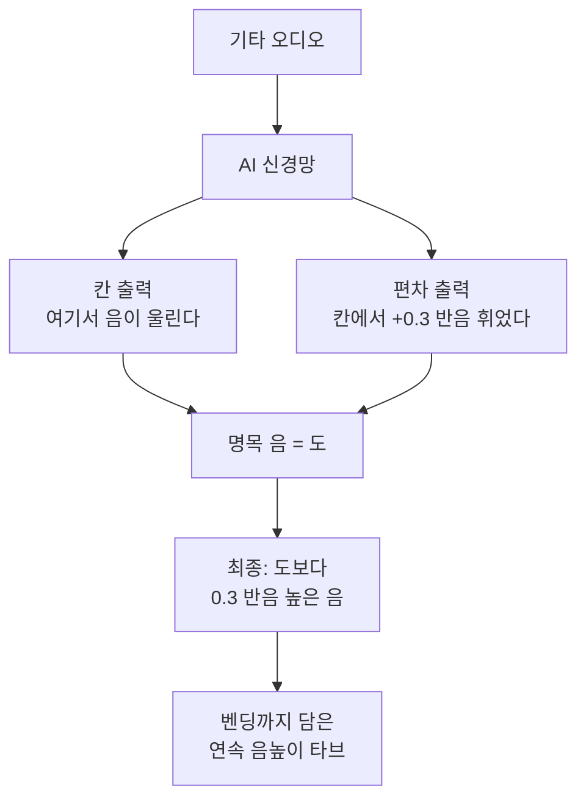

# FretNet — 비전공자 해설

## 이 논문이 풀려는 문제는 무엇인가

기타에는 음을 "휘게" 만드는 멋진 표현 기법들이 있습니다. **벤딩(bend)** — 줄을 손가락으로 밀어 올려 음을 슬쩍 높이는 기법, **슬라이드(slide)** — 손가락을 칸 사이로 미끄러뜨려 음을 끌어올리는 기법, **비브라토(vibrato)** — 음을 가늘게 떨리게 하는 기법. 이런 기법들은 기타 연주의 감정과 개성을 살리는 핵심입니다.

그런데 컴퓨터가 음악을 받아쓸 때는 보통 음높이를 **피아노 건반처럼 딱딱 끊어진 칸**으로만 표현합니다. "도, 도#, 레, 레#..." 이렇게요. 문제는 벤딩으로 음을 '도'에서 '도와 도# 사이 어딘가'로 슬쩍 밀어 올리면, 이 끊어진 칸 체계로는 그 미묘한 중간값을 적을 수가 없다는 겁니다. 마치 온도를 0도, 1도, 2도처럼 정수로만 적을 수 있어서 "36.5도"를 못 적는 체온계와 같죠.

기존에는 해상도를 높이려면 칸을 잘게 쪼개 출력 칸 수를 잔뜩 늘리고, 그만큼 AI 모델을 무겁고 복잡하게 만들어야 했습니다. FretNet은 이 문제를 훨씬 우아하게 풉니다.

## 한 줄 비유로 본 핵심

체온을 적을 때 "36도"라는 **칸**과 "+0.5도"라는 **바늘의 미세 위치**를 따로 적으면, 칸을 잘게 쪼개지 않고도 36.5도를 정확히 표현할 수 있습니다. **FretNet은 '어느 칸에서 음이 울리는가'와 '그 음이 칸에서 얼마나 휘었는가'를 따로 출력해, 음의 미끄러짐까지 받아쓰는 채보기**입니다.

## 핵심 아이디어를 한 그림으로

## 알아야 할 핵심 용어

| 용어 | 영문 | 직관적 설명 |
|---|---|---|
| 연속값 음높이 | Continuous-valued pitch | 끊어진 칸이 아니라 그 사이 값까지 표현하는 음높이 (36.5도 같은) |
| 음높이 변조 | Pitch modulation | 벤딩·슬라이드처럼 음을 미끄러지듯 휘게 하는 것 |
| 다중음 추정 | Multi-Pitch Estimation (MPE) | 동시에 울리는 여러 음을 한꺼번에 알아내기 |
| 노트 트래킹 | Note Tracking (NT) | 순간순간의 음들을 하나의 '음표'로 묶어내기 |
| 온셋 | Onset | 음이 시작되는 바로 그 순간 |
| 편차 뉴런 | Deviation neuron | "칸에서 얼마나 휘었는지"만 전담하는 AI 출력 하나 |
| 연속 베르누이 | Continuous Bernoulli | 0~1 사이 연속값을 자연스럽게 다루는 확률 도구 |
| 허용오차 | Tolerance | 채점할 때 "이만큼 빗나가도 정답"으로 인정하는 폭 |

## 어떻게 작동하는가

1. **소리를 배음까지 펼쳐 본다.** FretNet은 입력으로 일반 스펙트로그램 대신 **Harmonic CQT** 라는 것을 씁니다. 한 음에는 기본음 말고도 배음(딸려 나오는 소리)이 함께 울리는데, 이 배음들을 여러 겹으로 나란히 쌓아 보여주면 AI가 "이게 진짜 어떤 음인지" 더 잘 짚어냅니다.

2. **각 줄·칸마다 질문을 둘로 나눈다.** 핵심입니다. 6개 줄 × 여러 칸의 각 자리마다 두 가지를 따로 묻습니다.
   - "여기서 음이 **울리고 있는가?**" (켜짐/꺼짐)
   - "울린다면 명목 음에서 **얼마나 휘었는가?**" (예: +0.3 반음)
   
   이렇게 하면 음의 '존재'는 깔끔한 음표로, 음의 '휘어짐'은 연속값으로 각각 자연스럽게 다뤄집니다. 게다가 자리마다 **딱 하나의 추가 뉴런**만 있으면 되니 모델이 거의 무거워지지 않습니다.

3. **음표의 시작을 따로 잡는다.** 별도의 **온셋(onset) 감지기**가 "여기서 새 음표가 시작됐다"를 짚어줍니다. 덕분에 잠깐 스쳐 지나간 잡음과 진짜 음표를 구분해, 깔끔한 음표 단위 결과를 냅니다.

## 왜 중요한가

FretNet의 가장 큰 성과는 **"칸을 잘게 쪼개지 않고도 무한히 세밀한 음높이를 표현"** 한 점입니다. 자리마다 뉴런 하나만 더했을 뿐인데, 채점 기준을 빡빡하게(허용오차를 1/2 반음에서 1/16 반음으로) 좁힐수록 이전 모델(TabCNN)과의 점수 격차가 쭉 벌어졌습니다 — 그만큼 음의 미세한 높이를 정확히 잡아낸다는 뜻입니다.

또한 **음표를 깔끔하게 묶어내는 능력**(노트 레벨 종합 점수가 0.58에서 0.66으로 향상)도 좋아졌습니다. 온셋 감지기가 진짜 음표만 골라내 정확도를 높인 덕입니다.

다만 한계도 솔직히 짚어야 합니다. 학습·평가에 쓴 **GuitarSet** 데이터에는 벤딩·슬라이드 같은 기법이 따로 '정답'으로 표시돼 있지 않습니다. 그래서 FretNet이 음의 휘어짐을 **표현할 능력**은 분명히 보여줬지만, "실제 벤딩을 얼마나 잘 잡아내는가"를 숫자로 완벽히 증명한 것은 아닙니다. 그리고 이 모든 점수는 **깨끗하게 녹음된 솔로 어쿠스틱 기타** 위에서 나온 것이라, 앰프를 거친 일렉 기타나 밴드 합주가 섞인 실제 노래에서는 더 낮아집니다.

그럼에도 FretNet은 "음악을 받아쓸 때 음의 미끄러짐과 떨림까지 담자"는 새로운 방향을 제시했고, 이는 기타뿐 아니라 음높이가 자유롭게 변하는 다른 악기에도 적용될 수 있는 의미 있는 첫걸음입니다.
