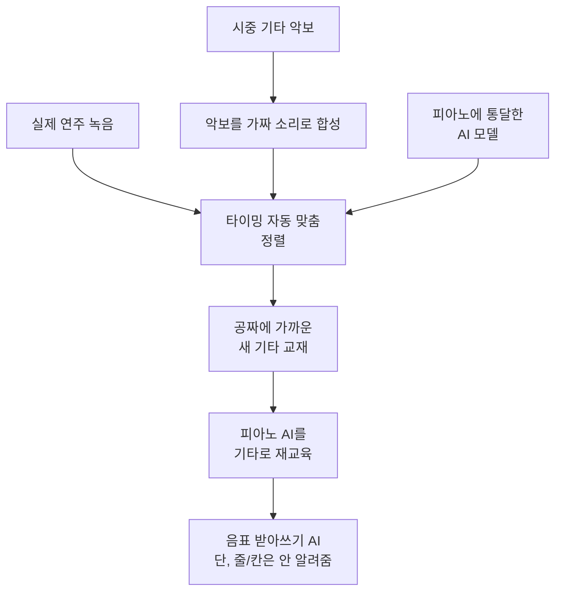

# High Resolution Guitar Transcription via Domain Adaptation — 비전공자 해설

## 이 논문이 풀려는 문제는 무엇인가

AI에게 무언가를 잘 시키려면 **풍부한 교재(데이터)** 가 필요합니다. 피아노 자동 채보 AI는 운이 좋았습니다. MAESTRO, MAPS 같은 거대하고 깨끗한 연습 교재가 있어서, 사람의 손가락 움직임과 소리가 정확히 짝지어진 데이터를 수십 시간 분량으로 학습할 수 있었거든요. 그래서 피아노 채보 AI는 이미 매우 정확합니다.

그런데 기타는 사정이 딱합니다. 피아노만큼 크고 깨끗한 교재가 거의 없습니다. 사실상 GuitarSet이라는 작은 데이터셋 하나에 모두가 의존하는 형편이죠. 새 교재를 만들려면 사람이 일일이 "이 음은 언제 시작해서 언제 끝나는지"를 손으로 표시해야 하는데, 시간과 전문성이 엄청나게 듭니다.

이 논문의 영리한 아이디어는 이렇습니다. **시중에 파는 기타 악보집을 교재로 재활용하자.** 악보에는 어떤 음을 칠지 적혀 있으니, 그 악보와 실제 연주 녹음을 잘 맞춰 붙이면(정렬하면) 공짜에 가까운 새 교재가 생깁니다. 문제는 악보에 적힌 타이밍과 사람이 실제로 친 타이밍이 미묘하게 어긋난다는 점인데, 이걸 자동으로 맞춰주는 게 핵심 기술입니다.

## 한 줄 비유로 본 핵심

외국어를 배울 때, **이미 한 언어(피아노)에 통달한 통역사**에게 "발음만 살짝 다른 사촌 언어(기타)"를 가르치면 처음부터 배우는 사람보다 훨씬 빨리 익힙니다. **이 논문은 피아노에 통달한 AI를 데려와, 시중 악보를 교재 삼아 기타로 '재교육(도메인 적응)'시키는 방법**입니다.

## 핵심 아이디어를 한 그림으로

## 알아야 할 핵심 용어

| 용어 | 영문 | 직관적 설명 |
|---|---|---|
| 도메인 적응 | Domain Adaptation | 한 분야에서 배운 AI를 비슷한 다른 분야로 옮겨 재교육하기 |
| 제로샷 | Zero-shot | 해당 시험 데이터를 한 번도 안 배우고 그대로 시험 보기 |
| 지도 학습 | Supervised | 시험에 나올 데이터로 미리 공부한 뒤 시험 보기 |
| 정렬 | Alignment | 악보의 음표와 실제 녹음의 타이밍을 정확히 짝짓기 |
| 온셋 | Onset | 음이 시작되는 순간 |
| F1 점수 | F1 / F-measure | 정확함과 빠짐없음을 함께 본 종합 점수 (높을수록 좋음) |
| 고해상도 모델 | High-resolution model | 음의 시작·끝 시각을 아주 정밀하게(10밀리초 단위) 잡는 AI |

## 어떻게 작동하는가

1. **악보를 가짜 소리로 바꾼다.** 시중 악보를 컴퓨터로 연주시켜 대략적인 소리를 만듭니다. 이걸 실제 연주 녹음과 비교할 기준점으로 씁니다.

2. **타이밍을 자동으로 맞춘다(정렬).** 악보의 음표들을 실제 녹음의 소리에 두 단계로 맞춥니다. 먼저 큰 틀을 거칠게 맞추고, 그다음 화음처럼 "동시에 적혔지만 실제론 살짝 어긋나게 연주된" 음들을 미세하게 다듬습니다. 이 작업의 '자(尺)' 역할을 피아노에 통달한 고해상도 AI가 해줍니다. 이 AI는 타이밍이 조금 어긋난 교재로도 잘 배우는 강건함을 갖춰서, 정렬이 완벽하지 않아도 학습이 잘 됩니다.

3. **피아노 AI를 기타로 재교육한다.** 이렇게 만든 새 교재로, 피아노용으로 사전 학습된 AI를 기타에 맞게 다시 가르칩니다. 처음부터 기타를 배우는 것보다 훨씬 효율적입니다.

## 왜 중요한가

성과가 인상적입니다. 이 AI는 **GuitarSet을 단 한 곡도 공부하지 않은 상태(제로샷)** 에서 그 시험을 봤는데, 종합 점수 **87.3%** 로 기존의 어떤 발표 방법보다도 높았습니다. 보통은 시험 데이터로 미리 공부해야 점수가 잘 나오는데, 안 보고도 최고 점수를 냈다는 건 이 AI가 "특정 교재에만 익숙한 게 아니라 기타 일반을 잘 이해한다"는 강력한 신호입니다. 시험 데이터로 미리 공부한 경우(지도 학습)엔 **89.7%** 로, 당시 1위 모델과는 2% 안쪽으로 바짝 따라붙었습니다.

다만 **중요한 한계** 두 가지를 꼭 짚어야 합니다.

첫째, 이 AI는 **"어느 줄, 몇 번 칸에서 쳤는지"를 알려주지 않습니다.** 어떤 음이 언제 울렸는지(음표)만 받아쓸 뿐, 진짜 타브(TAB)의 핵심인 줄·칸 정보는 출력하지 않습니다. 그래서 엄밀히는 '타브 채보'가 아니라 '음표 채보'에 가깝습니다.

둘째, 벤딩·슬라이드 같은 **표현 기법은 다루지 않습니다.**

그리고 이 모든 점수(87.3%, 89.7%)는 **깨끗하게 녹음된 GuitarSet** 위에서 나온 숫자입니다. 저자들이 실제 재즈 기타 녹음 몇 곡에서도 좋은 일반화를 보이긴 했지만, 앰프와 이펙트가 잔뜩 걸린 일렉 기타나 밴드 합주가 섞인 진짜 노래에서는 점수가 더 낮아진다고 보는 게 맞습니다.

그럼에도 이 연구의 가치는 분명합니다. **"교재가 부족하면, 이미 잘하는 분야의 AI를 빌려와 시중 자료로 재교육하라"** 는 실용적이고 재현 가능한 길을 열어, 데이터 가뭄에 시달리던 기타 채보 연구에 숨통을 틔웠습니다. 바로 이 흐름이 다음 해 같은 팀의 대규모 데이터셋 [GAPS](https://arxiv.org/abs/2408.08653)로 이어집니다.
