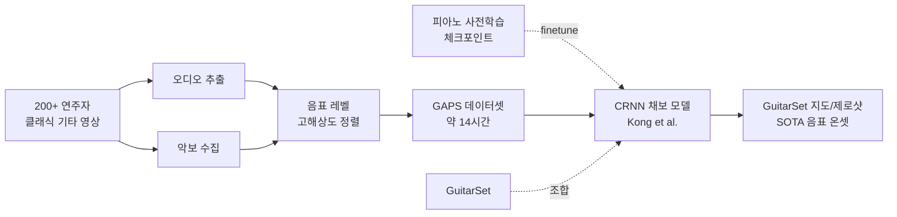

# GAPS: A Large and Diverse Classical Guitar Dataset and Benchmark Transcription Model 분석 보고서

## 핵심 요약

GAPS(**G**uitar-**A**ligned **P**erformance **S**cores)는 **클래식 기타 연주의 대규모·다양성 데이터셋** 과 그 위에서 학습한 **벤치마크 채보 모델** 을 함께 제시한다. GAPS는 자유롭게 이용 가능한 **약 14시간** 분량의 오디오-악보 정렬 쌍으로, **200명 이상의 연주자** 가 다양한 조건에서 녹음했으며, 고해상도 **음표 레벨 MIDI 정렬** 과 **연주 영상** 까지 포함한다. 이는 공개된 실제 기타 오디오 데이터셋 중 최대 규모다. GuitarSet(약 3시간, 6명)이 사실상 유일한 표준이던 상황에서, 규모와 연주자 다양성을 한 단계 끌어올린 것이 가장 큰 기여다.

데이터셋의 유용성을 입증하기 위해, 저자들은 선행 연구(Riley et al. 2024, ICASSP)와 동일한 **Kong et al.(ByteDance)의 고해상도 CRNN** 아키텍처로 여러 채보 모델을 학습했다. 이는 같은 모델 위에서 "데이터셋만 바꿨을 때"의 효과를 공정하게 비교하기 위함이다. 모델은 (1) GAPS만, (2) GAPS+GuitarSet 조합으로 학습되며, 각각 처음부터 학습한 버전과 두 피아노 사전학습 체크포인트에서 미세조정(finetune)한 버전을 둔다.

결과적으로 GAPS로 학습한 모델은 GuitarSet의 **지도(supervised)** 와 **제로샷(zero-shot)** 설정 모두에서 당시 최고 성능(state-of-the-art)을 기록했다. 더 큰 데이터셋이 성능 향상을 견인했다는 것이 핵심 메시지다. 모든 수치는 클린 벤치마크 기준이며, 본 모델 역시 음표 온셋을 추정하고 **프렛/현은 출력하지 않는다.**

## 서지 정보

- **제목:** GAPS: A Large and Diverse Classical Guitar Dataset and Benchmark Transcription Model
- **저자:** Xavier Riley, Zixun Guo, Drew Edwards, Simon Dixon
- **소속:** Centre for Digital Music (C4DM), Queen Mary University of London (QMUL)
- **발표처:** ISMIR 2024 (International Society for Music Information Retrieval Conference)
- **연도:** 2024 (v1 2024-08-16, v2 2024-08-30)
- **arXiv:** [arXiv:2408.08653](https://arxiv.org/abs/2408.08653)
- **라이선스:** CC BY-NC-SA 4.0

## 상세 요약

기타 채보 연구의 고질적 병목은 **정렬된 주석(aligned annotation)이 있는 실제 기타 오디오의 부족** 이다. GuitarSet은 약 3시간, 6명의 연주자로 구성돼 분포가 좁다. GAPS는 이를 정면으로 겨냥한다. 자유롭게 구할 수 있는 클래식 기타 연주(오디오)와 그 악보를 모아, 음표 단위로 고해상도 정렬한 약 14시간 데이터셋을 구축했다. 200명이 넘는 연주자, 다양한 녹음 환경, 그리고 연주 영상까지 포함해 — 규모뿐 아니라 다양성과 멀티모달 측면에서도 기존 자원을 능가한다.

벤치마크 모델은 선행 연구와의 **공정 비교**를 의식해 설계됐다. 백본은 Kong et al.의 고해상도 모델 — log mel-spectrogram의 10초 구간을 MIDI로 매핑하는 CRNN이다. 합성곱은 주파수 축으로만 작동해 원 스펙트로그램의 시간 해상도(10ms)를 유지하고, GRU(게이트 순환 유닛)가 이를 받아 음높이·시간 창마다 온셋·오프셋·프레임 활성도·벨로시티를 출력한다. 이 모델을 고른 이유는 두 가지다: (1) Riley et al.(2024)와 같은 아키텍처라 GAPS 데이터의 순수 효과를 분리해 볼 수 있고, (2) 여러 피아노 채보 모델이 같은 구조를 공유해 **미세조정(도메인 적응)** 실험이 가능하다.

학습은 두 묶음으로 나뉜다. 첫째 묶음은 GAPS만으로 학습해 **전체 GuitarSet 제로샷** 추론에 쓰고, 둘째 묶음은 GAPS+GuitarSet로 학습해 GuitarSet·François Leduc·GAPS의 test split에서 평가한다. 각 묶음은 (a) 처음부터 학습, (b) 체크포인트 [10]에서 미세조정, (c) 체크포인트 [13]에서 미세조정의 3변형을 둔다. GAPS는 곡 단위 90:10으로 분할하고, 오디오는 10초 청크(hop 1초)로 자르며, 학습 시 ±3 반음 피치 시프팅을 증강으로 적용한다.

## 방법론과 데이터

| 항목 | 내용 |
|---|---|
| 데이터셋 규모 | 약 14시간 오디오-악보 정렬 쌍, 200명 이상 연주자, 클래식 기타 |
| 주석 | 고해상도 음표 레벨 MIDI 정렬 + 연주 영상(멀티모달) |
| 비교 데이터셋 | GuitarSet(약 3시간, 6명), EGDB(2시간 일렉, 헥사포닉) 등 |
| 백본 모델 | Kong et al.(ByteDance) 고해상도 CRNN — log mel → MIDI, 주파수축 conv + GRU, 10ms 해상도, 온셋·오프셋·프레임·벨로시티 출력 |
| 학습 구성 | ① GAPS만 → 제로샷 ② GAPS+GuitarSet → 지도. 각 3변형(scratch / 체크포인트[10] finetune / 체크포인트[13] finetune) |
| 데이터 분할 | GAPS 곡 단위 90:10, 10초 청크(hop 1s) |
| 증강 | 학습 시 ±3 반음 피치 시프팅 |
| 출력 | 음표 온셋 (프렛/현 미출력) |
| 평가 | mir_eval, 50ms onset-only P/R/F1, GuitarSet 지도/제로샷 + FL + GAPS test |

## 결과와 의의

모든 수치는 **클린한 GuitarSet** 위에서 50ms 허용오차 **onset-only F1**(P50/R50/F50, %, mir_eval)이다.

**지도 설정 — GuitarSet test split (논문 Table 3, 발췌):**

| 모델 | P50 | R50 | F50 |
|---|---|---|---|
| Basic Pitch | - | - | 79.0 |
| MT3 | - | - | 90.0 |
| Lu et al. | - | - | 91.1 |
| Riley et al. 2024 (GS+FL) | 91.1 | 88.5 | 89.7 |
| **본 논문 (GAPS+GS, [13]에서 finetune)** | 91.3 | 90.7 | **91.2** |
| 본 논문 (GAPS+GS, [10]에서 finetune) | 89.4 | 92.1 | 90.7 |

**제로샷 설정 — 전체 GuitarSet (GuitarSet 미학습) (논문 Table 4, 발췌):**

| 모델 | P50 | R50 | F50 |
|---|---|---|---|
| MT3 | - | - | 32.0 |
| Zang et al. (SynthTab) | - | - | 70.2 |
| Maman (MusicNet_EM) | 86.6 | 80.4 | 82.9 |
| Riley et al. 2024 | 88.0 | 87.1 | 87.3 |
| 본 논문 (scratch) | 92.4 | 81.8 | 86.1 |
| 본 논문 ([10]에서 finetune) | 91.6 | 83.7 | 87.0 |
| **본 논문 ([13]에서 finetune)** | 91.1 | 85.9 | **88.1** |

핵심 발견:

- **지도 설정**에서 GAPS+GuitarSet(피아노 체크포인트 [13] 미세조정) 모델이 **F1 91.2%** 로, 선행 SOTA(Lu et al. 91.1, Riley 2024 89.7)를 넘는다.
- **제로샷 설정**에서 GAPS만으로 학습 후 미세조정한 모델이 **F1 88.1%** 로, 선행 SOTA(Riley 2024의 87.3)를 갱신한다.
- 아키텍처가 Riley et al.(2024)와 동일하므로, 성능 향상의 주된 동인은 **더 큰 데이터셋(GAPS)** 임이 분명하다 — 데이터 규모가 모델을 견인한다는 메시지를 실험으로 뒷받침.
- 피아노 사전학습 체크포인트에서의 미세조정이 일관되게 도움을 준다(도메인 적응의 효과 재확인).

학술적 의의: GAPS는 GuitarSet 이후 처음으로 **규모·다양성·멀티모달(영상 포함)** 을 동시에 갖춘 공개 실기타 데이터셋이다. 클래식 기타라는 영역에서 음표 레벨 정렬 MIDI를 제공해, 후속 연구의 학습·평가 토대를 넓혔다.

## 한계와 비판

- **프렛/현 미출력:** 벤치마크 모델은 선행 Riley et al.(2024)과 마찬가지로 음표 온셋을 추정하며 **현·프렛을 출력하지 않는다.** 따라서 '음표 채보'이지 '타브 채보'가 아니다. TabCNN/FretNet 같은 진정한 타브 출력과는 과제 정의가 다르다.

- **확장 주법·오프셋 한계:** 평가가 onset-only(50ms)에 집중된다. 클래식 기타의 슬러(slur)·하모닉스·라스게아도 등 표현은 별도로 다뤄지지 않으며, 음 길이(오프셋)·세기도 핵심 평가에서 빠진다.

- **장르 편향(클래식):** GAPS는 **클래식 기타** 중심이다. 나일론 현 어쿠스틱 분포에 치우쳐, 일렉 기타·강한 이펙트·왜곡 톤에는 그대로 일반화되지 않을 수 있다. 200명 연주자라는 다양성은 연주자·녹음 환경의 다양성이지 음향적 장르의 폭은 아니다.

- **클린 벤치마크 vs 실음원:** 보고된 91.2%/88.1%는 모두 **깨끗한 GuitarSet** 기준이다. GAPS 자체가 비교적 정제된 클래식 기타 녹음이므로, 잡음·반향·밴드 합주 분리 후 음원 같은 실제 야생 조건의 성능은 별도 검증이 필요하며 더 낮다고 보는 것이 합리적이다.

- **정렬 품질 의존:** 음표 레벨 정렬의 정확도가 라벨 품질을 좌우한다. 악보와 연주가 크게 다른 즉흥적 해석이나 자유 템포 구간에서는 정렬 오차가 라벨에 그대로 반영될 수 있다.

- **라이선스 제약:** CC BY-NC-SA(비상업) 라이선스로, 상업적 활용에는 제약이 있다.
