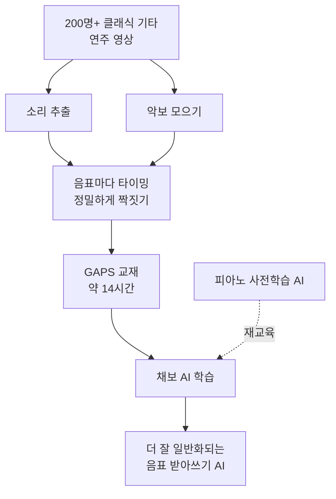

# GAPS — 비전공자 해설

## 이 논문이 풀려는 문제는 무엇인가

AI에게 기타 채보를 가르치려면 **연습 교재(데이터)** 가 필요한데, 기타 분야는 늘 교재가 모자랐습니다. 사실상 **GuitarSet** 이라는 데이터셋 하나에 모두가 의존해 왔습니다. 그런데 이 교재는 분량이 약 3시간에, 연주자가 단 6명뿐입니다. 6명의 연주 습관과 녹음 환경만 잔뜩 배운 AI는, 처음 보는 다른 사람의 연주 앞에서 휘청거리기 쉽습니다. 마치 6명의 글씨체만 보고 자란 사람이 낯선 손글씨를 잘 못 읽는 것과 같죠.

게다가 새 교재를 만드는 건 보통 일이 아닙니다. 녹음마다 사람이 "이 음은 언제 시작해서 언제 끝났는지"를 일일이 손으로 표시해야 하니까요.

GAPS는 이 교재 가뭄을 정면으로 해결합니다. 자유롭게 구할 수 있는 **클래식 기타 연주 영상과 악보**를 잔뜩 모아, 음표 하나하나를 컴퓨터로 정밀하게 짝지어 붙였습니다. 그 결과 **약 14시간 분량, 200명이 넘는 연주자**, 게다가 **연주 영상까지** 포함된, 공개된 기타 데이터셋 중 가장 큰 교재를 만들어냈습니다.

## 한 줄 비유로 본 비교

기존 교재(GuitarSet)가 **6명의 글씨만 모은 얇은 노트**였다면, **GAPS는 200명이 넘는 사람의 글씨를 14시간어치 모은 두툼한 교본**입니다. 다양한 글씨를 많이 본 AI일수록 낯선 손글씨도 잘 읽어냅니다.

## 핵심 아이디어를 한 그림으로

## 알아야 할 핵심 용어

| 용어 | 영문 | 직관적 설명 |
|---|---|---|
| 데이터셋 | Dataset | AI를 가르치는 연습 교재 모음 |
| 정렬 | Alignment | 악보의 음표와 실제 녹음의 타이밍을 정확히 짝짓기 |
| 음표 레벨 MIDI | Note-level MIDI | 각 음이 언제 시작·끝나는지를 컴퓨터가 읽는 형식으로 적은 것 |
| 멀티모달 | Multimodal | 소리 + 영상처럼 여러 종류의 데이터를 함께 담은 것 |
| 제로샷 | Zero-shot | 시험 데이터를 한 번도 안 배우고 그대로 시험 보기 |
| 지도 학습 | Supervised | 시험에 나올 데이터로 미리 공부하고 시험 보기 |
| 미세조정 | Finetuning | 이미 똑똑한 AI를 새 목적에 맞게 살짝 더 가르치기 |
| 일반화 | Generalization | 배운 적 없는 새 데이터에서도 잘 해내는 능력 |

## 어떻게 작동하는가

1. **공개 연주 영상을 모은다.** 인터넷에 자유롭게 공개된 클래식 기타 연주 영상을 폭넓게 수집합니다. 200명이 넘는 다양한 연주자가 다양한 환경에서 녹음한 것들입니다.

2. **악보와 소리를 짝짓는다(정렬).** 각 연주에 해당하는 악보를 찾아, 음표 하나하나가 녹음의 어느 시점에 울렸는지 컴퓨터로 정밀하게 맞춰 붙입니다. 이 작업이 핵심이며, 덕분에 사람이 일일이 손으로 표시하지 않고도 정답이 붙은 교재가 완성됩니다.

3. **공정하게 효과를 검증한다.** 저자들은 영리하게도, 바로 전해의 자기 연구([Riley et al. 2024](https://arxiv.org/abs/2402.15258))와 **똑같은 AI 구조**를 씁니다. 구조는 그대로 두고 교재만 GAPS로 바꿨을 때 성적이 얼마나 오르는지 보면, 향상이 순전히 "더 큰 교재" 덕분임을 깔끔하게 증명할 수 있으니까요. 여기에 피아노로 미리 학습된 AI를 가져와 기타로 재교육(미세조정)하는 방법도 함께 씁니다.

## 왜 중요한가

결과는 명확했습니다. GAPS로 학습한 AI는 표준 시험(GuitarSet)에서 두 가지 방식 모두 당시 최고 점수를 냈습니다.

- **미리 공부하고 본 시험(지도 학습): 종합 점수 91.2%** — 이전 1위(91.1%)를 넘어섰습니다.
- **안 보고 본 시험(제로샷): 종합 점수 88.1%** — 이전 최고(87.3%)를 갱신했습니다.

구조는 그대로인데 교재만 키웠더니 점수가 올랐으니, 메시지는 분명합니다. **"기타 채보를 잘하려면, 더 크고 다양한 교재가 답이다."**

다만 솔직한 한계도 있습니다.

첫째, 이 벤치마크 AI 역시 **"어느 줄, 몇 번 칸에서 쳤는지"는 알려주지 않습니다.** 어떤 음이 언제 울렸는지(음표)만 받아쓸 뿐, 진짜 타브(TAB)의 핵심인 줄·칸 정보는 빠져 있습니다. 그래서 '음표 채보'에 가깝습니다.

둘째, GAPS는 **클래식 기타** 중심입니다. 나일론 줄 어쿠스틱 위주라, 앰프와 왜곡이 잔뜩 걸린 일렉 기타에는 그대로 통하지 않을 수 있습니다. "200명"이라는 다양성은 사람과 녹음 환경의 다양성이지, 음악 장르나 기타 종류의 다양성은 아닙니다.

셋째, 보고된 점수(91.2%, 88.1%)는 모두 **깨끗한 GuitarSet** 위에서 나온 것입니다. GAPS 자체도 비교적 정돈된 클래식 기타 녹음이라, 잡음·울림이 심하거나 밴드 합주에서 떼어낸 진짜 야생 음원에서는 점수가 더 낮아집니다.

그럼에도 GAPS의 의의는 큽니다. GuitarSet 이후 오랫동안 정체돼 있던 "교재 부족" 문제에, **크고 다양하며 영상까지 곁들인** 공개 데이터셋으로 돌파구를 마련했기 때문입니다. 앞으로의 기타 채보 연구가 더 넓은 토대 위에서 출발할 수 있게 된 셈입니다.
