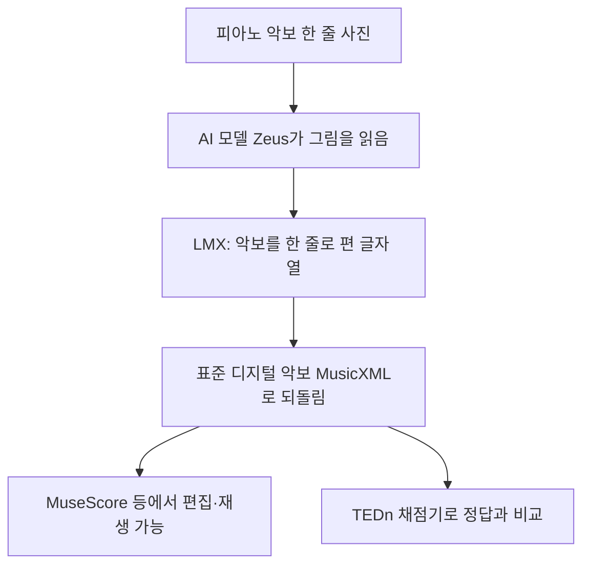

# 피아노 악보를 위한 실용적 종단간 광학 악보 인식(OLiMPiC) — 비전공자 해설

## 이 논문이 풀려는 문제는 무엇인가

먼저 아주 중요한 구분 하나. 이 논문은 **소리를 듣고 악보를 받아 적는 기술이 아니다.** 반대로, **이미 인쇄된 악보 "사진"을 컴퓨터가 읽어서 디지털 악보로 바꾸는 기술**이다. 종이 악보를 스캔하거나 사진을 찍으면, 컴퓨터가 그 그림 속 음표·박자·조표를 알아보고 편집·재생 가능한 데이터로 변환해 준다. 이를 **광학 악보 인식(Optical Music Recognition, OMR)** 이라고 한다.

비유하자면, 종이에 인쇄된 글자를 사진 찍어 텍스트 파일로 바꾸는 **OCR(광학 문자 인식)** 의 "악보 버전"이다. 글자 OCR은 이미 흔하다. 그런데 악보 OCR은 훨씬 어렵다. 글은 왼쪽에서 오른쪽으로 한 줄씩 읽으면 끝이지만, **악보는 위아래로도 읽어야 하기 때문**이다.

특히 골치 아픈 게 **피아노 악보**다. 피아노 악보는 오른손용 윗줄과 왼손용 아랫줄이 동시에 진행되고, 한 줄 안에서도 여러 멜로디(성부)가 겹쳐 흐른다. 마치 여러 사람이 동시에 말하는 회의록을 받아 적는 것과 같아서, "어떤 순서로 적어야 하는가?"부터가 난제다.

## 한 줄 비유로 본 핵심

> **이 연구는 "악보 사진을 찍으면 컴퓨터가 음표를 알아보는 OCR"인데, 가장 까다로운 피아노 악보를 표적으로 삼는다.** 핵심 아이디어는 "복잡한 2차원 악보를 표준과 호환되는 1줄짜리 글자 열로 깔끔하게 펴서(LMX) AI에게 읽히는 것"이다.

## 핵심 아이디어를 한 그림으로

## 알아야 할 핵심 용어

| 용어 | 영문 | 직관적 설명 |
| --- | --- | --- |
| 광학 악보 인식 | Optical Music Recognition (OMR) | 악보 "그림"을 읽어 디지털 악보로 바꾸는 기술 (소리 아님) |
| 피아노 악보 | Pianoform / Grand staff | 위·아래 두 줄에 여러 성부가 얽힌 어려운 악보 |
| MusicXML | MusicXML | 악보 소프트웨어가 공통으로 쓰는 표준 디지털 악보 형식 |
| 선형화 MusicXML | LMX (Linearized MusicXML) | 2차원 악보를 표준과 호환되게 한 줄로 편 글자 열 |
| 이미지→시퀀스 | img2seq | 그림을 넣으면 글자 열을 뱉는 AI 구조 |
| 종단간 | End-to-End | 중간 단계 없이 입력→출력을 한 번에 처리 |
| OLiMPiC | OLiMPiC | 이 논문이 만든 피아노 악보 학습용 데이터 모음 |
| Zeus | Zeus | 이 데이터로 학습한 베이스라인 인식 모델 |
| TEDn | Tree Edit Distance | 예측 악보를 정답으로 고치는 데 드는 수정량으로 채점 |

## 어떻게 작동하는가

1. **악보 한 줄을 입력으로 받는다.** 모델은 페이지 전체가 아니라 악보 "한 줄(시스템, 약 4마디)"씩 본다. 마치 긴 문서를 문단 단위로 잘라 읽는 것과 비슷하다.

2. **그림을 한 줄짜리 글자 열로 바꾼다.** 여기가 이 논문의 묘수다. 복잡한 2차원 악보를 그대로 다루는 대신, **LMX**라는 형식으로 한 줄로 쭉 편다. 예를 들어 "도 4분음표, 미 4분음표, 솔 4분음표..." 처럼 토큰(글자)을 순서대로 늘어놓는다. 중요한 건, 이 LMX가 **악보 소프트웨어의 표준 형식인 MusicXML과 거의 손실 없이 양방향으로 바뀐다**는 점이다. 그래서 새 형식을 발명한 게 아니라 "표준을 한 줄로 편 것뿐"이라고 강조한다.

3. **"보이는 모양"에 집중한다.** LMX는 소리 정보(정확한 재생 길이 등)가 아니라 **눈에 보이는 표기**를 적는다. 음 길이도 "0.5초" 같은 수치가 아니라 "8분음표"라는 모양으로 적는다. 사진에서 보이는 건 모양이지 소리가 아니기 때문이다.

4. **다시 표준 악보로 되돌리고 채점한다.** AI가 뱉은 LMX 글자 열을 다시 MusicXML로 되돌리면, MuseScore 같은 프로그램에서 바로 열어 편집·재생할 수 있다. 정확도는 **TEDn**이라는 채점기로 잰다. TEDn은 "예측한 악보를 정답 악보로 고치려면 음표를 몇 개나 바꿔야 하는가"를 세어 점수를 매긴다. 단, 이 채점이 매우 느려서(악보 한 줄당 최대 2분) 한 줄씩만 평가한다.

## 왜 중요한가

이 논문이 중요한 이유는 OMR을 **"실제로 쓸 수 있는 도구"에 가깝게** 만들었기 때문이다.

- **표준과 통한다**: 지금까지 OMR 연구들은 각자 자기만의 비표준 형식으로 결과를 내서, 정작 실제 악보 프로그램에서 열리지 않는 경우가 많았다. 이 논문의 LMX는 표준 MusicXML과 호환되므로, 인식 결과를 바로 MuseScore·Sibelius 같은 프로그램으로 보낼 수 있다.
- **모두가 비교할 기준을 줬다**: 데이터셋(OLiMPiC), 모델(Zeus), 채점기(TEDn)를 한꺼번에 공개해, 다른 연구자들이 똑같은 기준으로 자기 모델을 비교할 수 있게 했다.
- **가장 어려운 악보를 정조준**: 단선율이 아니라 두 손이 얽힌 피아노 악보를 표적으로 삼아, OMR이 풀어야 할 진짜 난제에 도전했다.

물론 한계도 솔직하다. 학습은 깨끗한 **컴퓨터 렌더링 악보**로만 하고 진짜 스캔 악보는 시험용으로만 써서, 잉크가 번지거나 종이가 낡은 실제 악보에서는 더 약할 수 있다. 또 셈여림·페달·가사 같은 일부 표현은 일부러 버린다(핵심 음표·박자·조표만 충실히 살린다). 그래도 "표준 호환 + 공개 데이터 + 표준 채점"이라는 실용 패키지를 제시한 점에서, 피아노 악보 인식 연구의 든든한 출발선을 놓은 작업으로 평가된다.

참고로, 이 작업은 **소리에서 음표를 뽑는 자동 채보(AMT)** 와는 입력부터 다르다는 점을 다시 기억하자. 여기서는 입력이 언제나 **악보 그림**이지 음원이 아니다.
