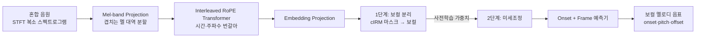

# Mel-RoFormer for Vocal Separation and Vocal Melody Transcription 분석 보고서

## 핵심 요약

이 논문은 ByteDance 연구팀이 ISMIR 2024에서 발표한 **Mel-RoFormer** 모델을 소개한다. Mel-RoFormer는 스펙트로그램(spectrogram, 시간-주파수 표현)을 입력으로 받는 트랜스포머 기반 모델로, 두 가지 음악 정보 검색(Music Information Retrieval, MIR) 과제를 동시에 겨냥한다. 하나는 **보컬 분리(vocal separation)** — 혼합 음원에서 노래하는 목소리만 깔끔히 떼어내는 것 — 이고, 다른 하나는 **보컬 멜로디 채보(vocal melody transcription)** — 그 노래의 주선율을 음표(음 시작·음높이·음 끝)로 받아 적는 것 — 이다.

핵심 기술은 두 가지다. 첫째, **Mel-band Projection(멜 대역 투영)** 모듈을 입력 앞단에 두어, 주파수 축을 사람 귀의 청각 특성을 닮은 **멜 스케일(Mel-scale)** 에 따라 여러 대역(subband)으로 나눈다. 멜 스케일은 저주파에서 분해능이 높고 고주파에서 낮은데, 이 방식의 대역은 서로 **겹치게(overlapping)** 나뉜다는 점이 선행 모델 BS-RoFormer의 겹치지 않는(non-overlapping) 대역 분할과 다르다. 둘째, **interleaved RoPE Transformer(교차 회전 위치 인코딩 트랜스포머)** 를 써서 주파수 축과 시간 축을 두 개의 별도 시퀀스로 번갈아 모델링한다.

학습 전략도 영리하다. 두 과제를 한 모델로 통합 학습하는 대신 **2단계(two-step)** 로 접근한다. 먼저 보컬 분리 모델을 학습한 뒤, 그것을 **기초 모델(foundation model)** 로 삼아 보컬 멜로디 채보용으로 미세조정(fine-tuning)한다. 실험 결과 Mel-RoFormer는 보컬 분리(MUSDB18HQ)와 멜로디 채보(MIR-ST500, POP909) 양쪽에서 모두 당시 최고 성능(state-of-the-art)을 달성했으며, 특히 가장 어렵다고 알려진 **음 끝(offset) 검출**에서 강한 견고함을 보였다.

## 서지 정보

- **제목**: Mel-RoFormer for Vocal Separation and Vocal Melody Transcription
- **저자**: Ju-Chiang Wang, Wei-Tsung Lu, Jitong Chen
- **소속**: ByteDance, San Jose, CA, USA
- **발표처**: 25th International Society for Music Information Retrieval Conference (ISMIR 2024), San Francisco, USA
- **연도**: 2024 (arXiv 제출: 2024년 9월 7일)
- **arXiv**: [arXiv:2409.04702](https://arxiv.org/abs/2409.04702) (DOI: [10.48550/arXiv.2409.04702](https://doi.org/10.48550/arXiv.2409.04702), 라이선스 CC BY 4.0)
- **선행 모델**: BS-RoFormer (Lu, Wang, Kong, Hung, ICASSP 2024) — 음원 분리 SDX'23 1위
- **공개 구현**: [github.com/lucidrains/BS-RoFormer](https://github.com/lucidrains/BS-RoFormer), 설정은 [Music-Source-Separation-Training](https://github.com/ZFTurbo/Music-Source-Separation-Training)

## 상세 요약

음악 오디오를 신경망으로 모델링하는 핵심 어려움은, 신호 안에 멜로디·화성·여러 악기의 음색이 복잡하게 얽혀 있다는 점이다. 전통적 방식은 스펙트로그램을 "시간에 따른 스펙트럼의 나열"로만 보고 주파수 축은 단순 특징 차원으로 취급했다. 그러나 최근에는 주파수 축 자체를 의미 있는 시퀀스로 명시적으로 모델링하는 것이 효과적임이 밝혀졌다. Mel-RoFormer의 직계 조상인 **BS-RoFormer**는 이 발상으로 음원 분리에서 큰 성공을 거뒀고(Sound Demixing Challenge 2023 음악 분리 트랙 1위), 그 핵심은 주파수를 여러 대역으로 쪼개는 **band-split** 모듈과, 시간·주파수를 두 시퀀스로 번갈아 처리하는 **interleaved 트랜스포머**였다.

Mel-RoFormer는 BS-RoFormer의 band-split을 **멜 스케일 기반 대역 분할**로 개선한 후속작이다. 입력은 복소 스펙트로그램 $X$ (채널 $C$ × 주파수 빈 $F$ × 시간 $T$)이며, STFT(단시간 푸리에 변환)로 얻는다. Mel-band Projection은 librosa의 멜 필터뱅크를 이진화해 주파수 빈을 $K$개의 (겹치는) 멜 대역으로 매핑하고, 각 대역마다 별도 MLP($\Lambda_k$, RMSNorm + 선형층)를 적용해 대역별 특징 벡터로 투영한다. 이는 "학습 가능한 멜 필터뱅크"로 볼 수 있어, 삼각 필터 같은 고정 모양에 얽매이지 않고 모델이 스스로 최적 필터 모양을 찾는다.

이어지는 **RoFormer 블록**은 $L$개의 교차 RoPE 트랜스포머 인코더로, 데이터를 시간 인덱스 형태 $(DK \times T)$ 와 대역 인덱스 형태 $(DT \times K)$ 로 번갈아 재배열하며 시간·주파수 정보를 교환한다. RoPE(회전 위치 인코딩)는 절대 위치 인코딩보다 성능이 좋고, 반복적 재배열에 대해 위치 정보를 견고히 보존한다. 마지막 **Embedding Projection** 모듈은 대역별 MLP($\Phi_k$)로 과제별 임베딩을 만든다.

**보컬 분리**에서는 Embedding Projection이 복소 이상비율마스크(complex Ideal Ratio Mask, cIRM)를 추정하고, 겹치는 멜 대역의 마스크 값은 평균낸다. 추정 마스크를 입력 스펙트로그램에 곱한 뒤 iSTFT로 시간 영역 신호를 복원한다. 손실은 시간 영역 MAE와 다중 해상도 복소 스펙트로그램 MAE의 합이다.

**보컬 멜로디 채보**에서는 사전학습된 분리 모델을 가져와 Embedding Projection만 새로 초기화하고, 모든 대역 출력 차원을 64로 통일한다. 그 위에 "Onsets and Frames" 방식의 **onset 예측기**(MLP, 60개 음높이 출력)와 **frame 예측기**(선형층, 61개 클래스)를 얹어 50Hz 프레임 단위로 음 시작과 지속을 예측한다. onset 임계값 0.45, frame 임계값 0.25를 쓰고, 두 예측기의 이진 교차엔트로피 손실 합으로 학습한다.

## 방법론과 데이터

| 항목 | 내용 |
| --- | --- |
| 입력 | 복소 스펙트로그램 $X$ ($C \times F \times T$), STFT로 생성 |
| 앞단 | Mel-band Projection: 멜 스케일 기반 **겹치는** 대역 분할 + 대역별 MLP |
| 본체 | $L$층 interleaved RoPE Transformer (시간·주파수 번갈아 모델링) |
| 분리 출력 | 복소 IRM(cIRM) 마스크 추정 → iSTFT로 보컬 복원 |
| 채보 출력 | Onsets and Frames: onset 예측기(60 음높이) + frame 예측기(61 클래스), 50Hz |
| 학습 전략 | 2단계: 보컬 분리 사전학습 → 멜로디 채보 미세조정 |
| 분리 데이터 | MUSDB18HQ(150곡), MoisesDB(240곡), In-House(1533곡) |
| 채보 데이터 | MIR-ST500(500곡), POP909(909곡) |
| 채보 지표 | mir_eval의 COn, COnP, COnPOff F-measure (피치 허용 50센트, 시간 허용 50ms; POP909는 80ms) |

## 결과와 의의

**보컬 분리 (MUSDB18HQ 테스트셋, SDR dB, 높을수록 좋음):**

| 모델 | Vocals SDR | 파라미터 | 비고 |
| --- | --- | --- | --- |
| HTDemucs (Sparse) | 9.37 | - | 추가 데이터 학습 |
| BSRNN | 10.01 | - | - |
| BS-RoFormer (b) | 12.82 | 93.4M | 추가 데이터, 선행 SOTA |
| **Mel-RoFormer (b)** | **13.29** | 105M | 추가 데이터, **SOTA** |
| BS-RoFormer (24k-small) | 10.56 | 8.0M | 24kHz 모노 |
| **Mel-RoFormer (24k-small)** | **11.01** | 9.1M | 24kHz 모노, 경량 |
| Mel-RoFormer (24k-large) | 12.69 | 50.7M | 24kHz 모노 |

Mel-band Projection은 BS-RoFormer 대비 전 시나리오에서 평균 약 **0.5dB** 일관된 SDR 향상을 가져왔다.

**보컬 멜로디 채보 (MIR-ST500 테스트셋, F-measure, 높을수록 좋음):**

| 모델 | 파라미터 | COn | COnP | COnPOff |
| --- | --- | --- | --- | --- |
| A-VST | - | .783 | .707 | .538 |
| Perceiver TF | - | - | .777 | - |
| SpecTNT | 8.4M | .801 | .778 | .550 |
| **Mel-RoF-small** | 14.5M | .807 | .786 | .609 |
| **Mel-RoF-large** | 64.6M | **.819** | **.798** | **.625** |

**POP909 테스트셋 (시간 허용 80ms):**

| 모델 | COn | COnP | COnPOff |
| --- | --- | --- | --- |
| SpecTNT | .797 | .775 | .371 |
| Mel-RoF-small | .831 | .805 | .398 |
| **Mel-RoF-large** | **.869** | **.842** | **.486** (시나리오 f에서 .494) |

특히 가장 어려운 **COnPOff(음 시작·음높이·음 끝 모두 정확)** 지표에서 Mel-RoF-large는 SpecTNT 대비 MIR-ST500에서 약 **7.5%p** 향상을 보였다. 이는 깨끗한 보컬을 먼저 분리해 다른 악기 간섭을 최소화한 덕분으로, "분리를 기초 과제로 삼아 사전학습한다"는 전략의 효과를 입증한다. 또 사전학습 모델을 쓰면 15K 스텝 이내로 수렴하지만, 처음부터 학습하면 50K 스텝이 필요하고 성능도 크게 떨어진다고 보고했다.

의의는 "음원 분리와 멜로디 채보를 하나의 아키텍처와 사전학습-미세조정 파이프라인으로 통합"한 데 있다. 저자들은 Mel-RoFormer가 코드 인식·다악기 채보 등 다른 MIR 과제의 기초 모델로도 확장될 잠재력이 있다고 결론짓는다.

## 한계와 비판

1. **막대한 학습 비용**: 44.1kHz 스테레오 분리 모델은 16×A100 GPU로 약 **93일**(시나리오 b, 100만 스텝) 학습했다. 작은 24kHz 모델도 V100 16장으로 약 31일이 걸린다. 학술 재현이나 소규모 연구실에는 사실상 접근 불가능한 비용이다.

2. **단성(monophonic) 멜로디 가정**: 보컬 멜로디 채보는 "주선율은 단성"이라고 가정한다. 화음 보컬, 백킹 보컬, 동시 다성 보컬이 섞인 경우는 다루지 못한다.

3. **레이블 품질 의존성**: 저자들 스스로 POP909의 음 끝·시간 정렬 주석이 부정확하다고 지적하며 시간 허용치를 50ms에서 80ms로 늘렸다. 데이터셋별 주석 품질 차이가 성능 해석을 복잡하게 만든다. 두 데이터셋을 합쳐 학습하면 POP909는 좋아지지만 MIR-ST500은 나빠지는 트레이드오프도 관찰됐다.

4. **파라미터 증가**: Mel-RoFormer는 BS-RoFormer 대비 성능은 좋지만 파라미터가 늘어난다(93.4M → 105M). 0.5dB 향상이 추가 비용에 값하는지는 용도에 따라 다르다.

5. **2단계 파이프라인의 복잡성**: 통합 모델이 아니라 분리→채보 2단계라 학습·배포 파이프라인이 복잡하다. 분리 단계의 오류가 채보 단계로 전파될 위험도 구조적으로 존재한다.

이런 한계에도 Mel-RoFormer는 보컬 분리와 멜로디 채보 양쪽에서 동시에 SOTA를 달성하고, 청각 특성에 맞춘 멜 대역 분할이라는 직관적 개선을 검증한 점에서 음악 오디오 모델링의 중요한 진전으로 평가된다.
