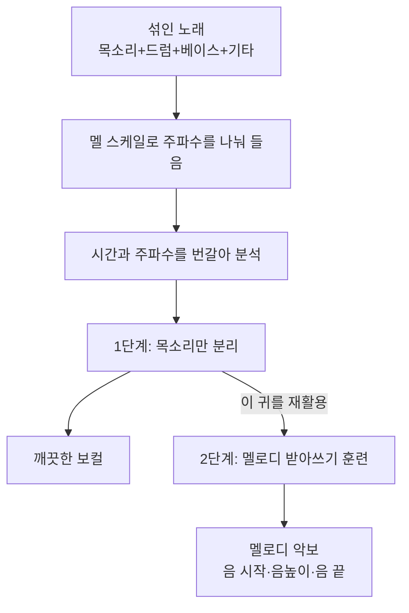

# Mel-RoFormer (보컬 분리와 보컬 멜로디 채보) — 비전공자 해설

## 이 논문이 풀려는 문제는 무엇인가

좋아하는 노래를 들으며 "이 가수가 부르는 멜로디만 딱 뽑아서 악보로 적고 싶다"고 생각해 본 적 있을 것이다. 그런데 완성된 노래에는 드럼·베이스·기타·신디사이저가 한꺼번에 섞여 있어서, 컴퓨터가 "어디까지가 목소리고 어디부터가 반주인지" 구분하기조차 어렵다. 시끄러운 파티장에서 한 사람의 목소리만 골라 듣는 것과 같은 문제다.

이 논문은 이 문제를 **두 단계로** 푼다. 첫째, **보컬 분리(vocal separation)** — 섞인 음원에서 목소리만 깨끗이 떼어낸다(노래방 MR 만들기의 반대로, 반주를 빼고 목소리만 남기는 것). 둘째, **보컬 멜로디 채보(vocal melody transcription)** — 그렇게 분리한 목소리를 듣고 멜로디를 음표(언제 시작해서, 어떤 음높이로, 언제 끝나는지)로 받아 적는다.

핵심 통찰은 이렇다. "목소리만 깨끗이 떼어낼 줄 아는 모델은, 이미 목소리에 대해 잘 아는 모델이다. 그러니 그 모델을 출발점으로 삼아 멜로디 받아 적기를 가르치자." 어수선한 음악 속에서 목소리를 가려내는 귀가 있다면, 그 귀에 악보 받아 적기를 추가로 훈련시키는 게 훨씬 쉽다는 발상이다.

## 한 줄 비유로 본 핵심

> **Mel-RoFormer는 먼저 "시끄러운 합주 속에서 가수 목소리만 골라 듣는 귀"를 훈련시킨 뒤, 그 귀에 "들은 멜로디를 악보로 받아 적기"를 가르친다.** 게다가 그 귀는 사람 청각을 흉내 낸 "멜 스케일"이라는 자를 써서 소리를 더 똑똑하게 나눠 듣는다.

## 핵심 아이디어를 한 그림으로

## 알아야 할 핵심 용어

| 용어 | 영문 | 직관적 설명 |
| --- | --- | --- |
| 보컬 분리 | Vocal Separation | 섞인 음원에서 노래 목소리만 떼어내기 |
| 보컬 멜로디 채보 | Vocal Melody Transcription | 분리한 목소리의 멜로디를 음표로 받아 적기 |
| 스펙트로그램 | Spectrogram | 소리를 시간×주파수로 펼쳐 그린 그림 |
| 멜 스케일 | Mel-scale | 사람 귀의 청각 특성을 닮은 주파수 눈금 |
| 멜 대역 투영 | Mel-band Projection | 소리를 멜 눈금에 따라 여러 대역으로 나눠 보는 앞단 |
| 트랜스포머 | Transformer | 시퀀스를 똑똑하게 처리하는 AI 구조 (ChatGPT의 그 구조) |
| 회전 위치 인코딩 | RoPE | 순서 정보를 잘 보존하는 위치 표시 기법 |
| 사전학습-미세조정 | Pretrain–Fine-tune | 먼저 큰 과제로 훈련 후, 본 과제로 미세 조정 |
| 음 끝 | Offset | 음표가 끝나는 시점 (받아 적기에서 가장 어려운 부분) |

## 어떻게 작동하는가

1. **소리를 "그림"으로 바꾼다.** 먼저 노래를 시간×주파수의 그림(스펙트로그램)으로 변환한다. 가로는 시간, 세로는 음높이다.

2. **사람 귀처럼 주파수를 나눠 듣는다(Mel-band Projection).** 사람 귀는 낮은 음의 미세한 차이는 잘 구별하지만, 높은 음의 차이는 둔감하다. Mel-RoFormer는 이 청각 특성을 닮은 **멜 스케일**로 주파수를 여러 대역으로 나눈다. 게다가 이전 모델(BS-RoFormer)과 달리 대역들이 **살짝 겹치게** 나뉘어, 경계에서 정보가 끊기지 않고 더 매끄럽게 처리된다. 이 부분이 모델 이름의 "Mel"이다.

3. **시간과 주파수를 번갈아 본다.** 그다음 트랜스포머가 "시간 흐름"과 "주파수 패턴"을 번갈아 가며 분석한다. 멜로디가 어떻게 흘러가는지(시간), 그리고 그 순간 어떤 음높이들이 울리는지(주파수)를 둘 다 챙기는 것이다. 순서 정보는 **RoPE**라는 기법으로 견고하게 보존한다.

4. **1단계 — 목소리만 떼어낸다.** 모델은 "이 주파수 성분 중 얼마만큼이 목소리인가"를 나타내는 일종의 마스크를 계산해, 원래 소리에 곱한 뒤 다시 소리로 되돌린다. 결과는 깨끗하게 분리된 보컬이다.

5. **2단계 — 멜로디를 받아 적는다.** 이제 1단계에서 훈련된 "목소리를 잘 아는 모델"을 가져와, 출력 부분만 새로 바꿔 멜로디 받아쓰기를 가르친다. "Onsets and Frames"라는 방식으로, 매 순간 (1) 새 음이 시작됐는지와 (2) 음이 계속 울리는지를 예측해 음표를 조립한다. 처음부터 가르치는 것보다 훨씬 빨리(약 1/3 스텝) 잘 배운다는 게 확인됐다.

## 왜 중요한가

Mel-RoFormer가 중요한 이유는 **두 마리 토끼를 한 구조로 잡았다**는 점이다.

- **분리와 채보 모두 최고 성능**: 보컬 분리(MUSDB18HQ에서 13.29dB)와 멜로디 채보(MIR-ST500·POP909) 양쪽에서 당시 최고 기록을 세웠다. 특히 받아쓰기에서 가장 어려운 **음 끝(offset) 맞히기**에서 크게 앞섰는데(가장 까다로운 지표에서 약 7.5%p 향상), 이는 목소리를 먼저 깨끗이 분리해 반주의 방해를 줄인 덕분이다.
- **"분리 → 채보" 전략의 효과 입증**: "목소리를 떼어낼 줄 아는 모델이 멜로디도 잘 받아 적는다"는 직관을 실험으로 증명했다. 이 사전학습-미세조정 발상은 다른 음악 AI 과제에도 응용될 수 있다.
- **사람 청각을 닮은 설계**: 멜 스케일과 겹치는 대역이라는 직관적 개선만으로 일관된 성능 향상을 얻어, "사람이 듣는 방식을 흉내 내는 게 효과적"임을 보였다.

다만 현실적 약점도 크다. 가장 큰 모델은 A100 GPU 16장으로 **약 93일** 학습해야 할 만큼 비용이 막대해서, 일반 연구자가 그대로 재현하기는 어렵다. 또 "주선율은 한 번에 한 음(단성)"이라고 가정하므로, 화음으로 부르는 합창이나 겹친 보컬은 다루지 못한다. 그래도 Mel-RoFormer는 "시끄러운 노래에서 멜로디를 뽑아내는" 어려운 문제를 한 단계 끌어올린, 음악 AI의 의미 있는 진전으로 평가된다.
